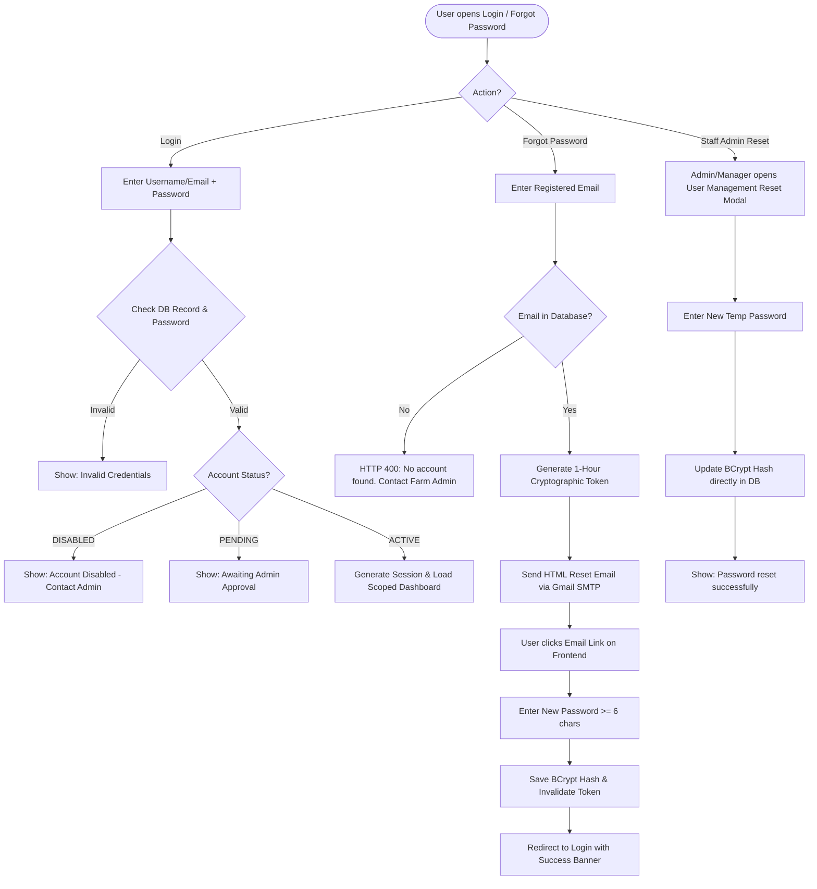
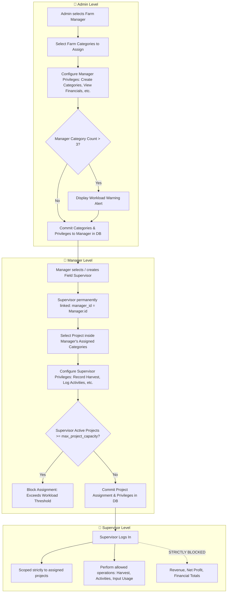
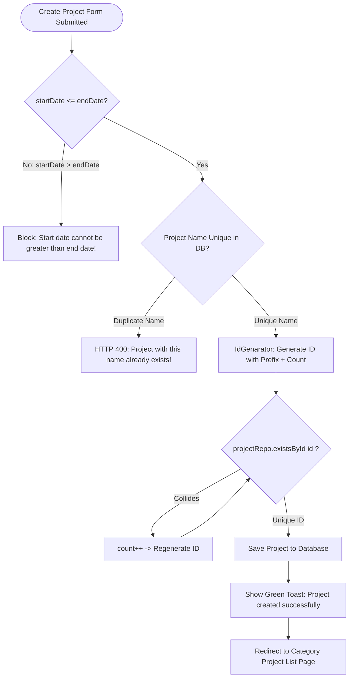
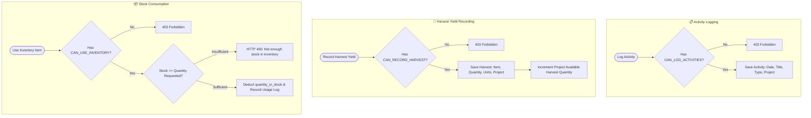
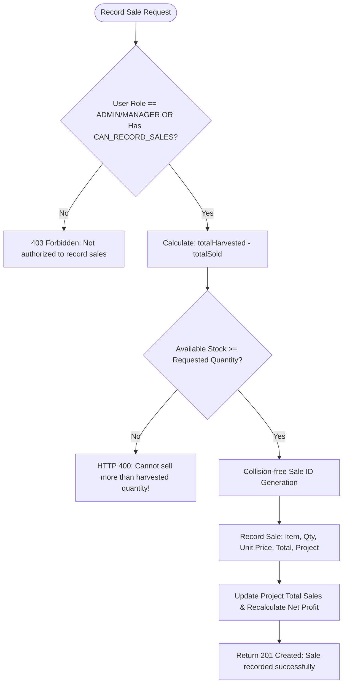
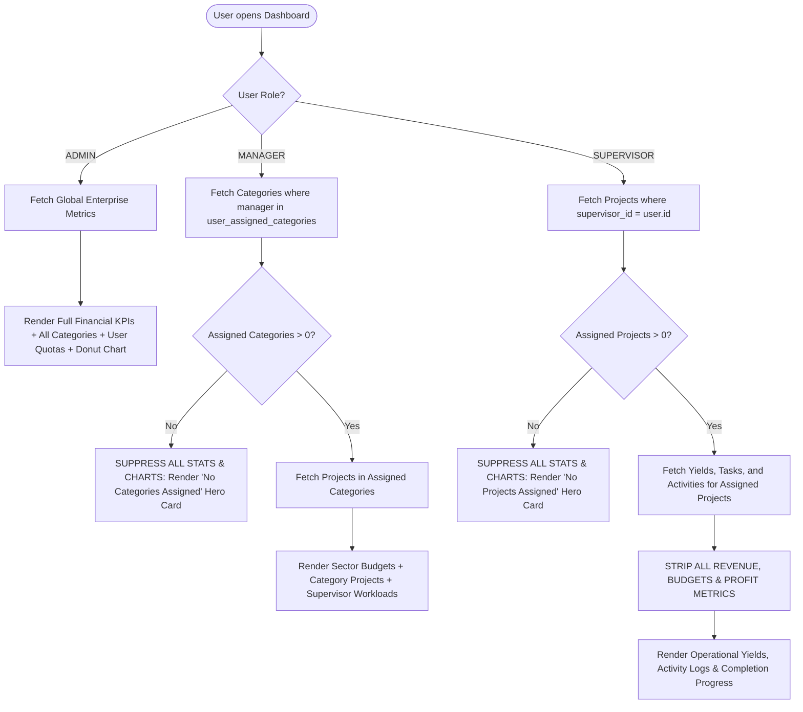
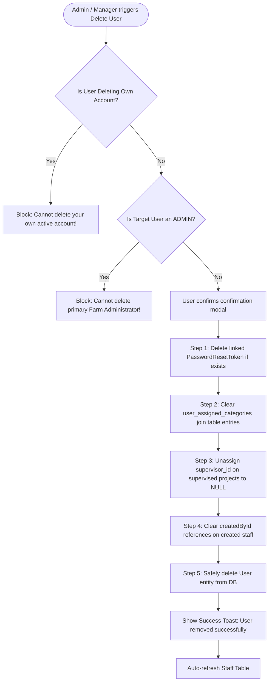

# SmartFarm Complete System Flowcharts Specification
**Document Version:** 1.0  
**SDLC Stage:** Phase 2 — System Architecture & Workflow Flowcharts  
**Status:** Approved Reference  

---

## Table of Flowcharts
1. [User Authentication & Password Recovery Flow](#1-user-authentication--password-recovery-flow)
2. [Hierarchical Access Delegation & Capacity Verification](#2-hierarchical-access-delegation--capacity-verification)
3. [Category & Project Lifecycle (With Date & ID Guards)](#3-category--project-lifecycle-with-date--id-guards)
4. [Field Operations & Inventory Consumption Flow](#4-field-operations--inventory-consumption-flow)
5. [Financial Governance & Stock-Backed Sales Flow](#5-financial-governance--stock-backed-sales-flow)
6. [Dynamic Scoped Dashboard & Zero-State Engine](#6-dynamic-scoped-dashboard--zero-state-engine)
7. [Safe User Deletion & Cascade Unlinking Flow](#7-safe-user-deletion--cascade-unlinking-flow)

---

## 1. User Authentication & Password Recovery Flow

---

## 2. Hierarchical Access Delegation & Capacity Verification

---

## 3. Category & Project Lifecycle (With Date & ID Guards)

---

## 4. Field Operations & Inventory Consumption Flow

---

## 5. Financial Governance & Stock-Backed Sales Flow

---

## 6. Dynamic Scoped Dashboard & Zero-State Engine

---

## 7. Safe User Deletion & Cascade Unlinking Flow

