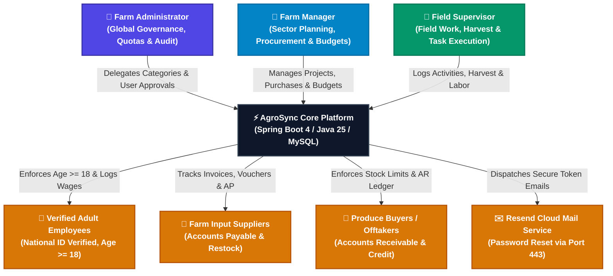

# Software Requirements Specification (SRS)
## AgroSync Farm Management System
**Document Version:** 4.0  
**SDLC Stage:** Production Baseline & Comprehensive Feature Specification  
**Status:** Approved  

---

## 1. Introduction

### 1.1 Purpose
This Software Requirements Specification (SRS) document provides a complete, authoritative specification of the functional, non-functional, security, compliance, and architectural requirements for the **AgroSync** (formerly SmartFarm) Agricultural Enterprise Management Platform. It serves as the primary contract and blueprint for software engineering, quality assurance, system administration, and operational auditing.

### 1.2 Scope of the System
**AgroSync** is an end-to-end, multi-tenant agricultural enterprise resource planning (ERP) system designed for commercial farming enterprises, cooperative unions, and agricultural estates. The platform unifies:
- **Executive Governance & Multi-Category Financial Control**: Global budgeting, sector delegation, and dual-ledger Accounts Payable (AP) and Accounts Receivable (AR) management for **Farm Administrators**.
- **Sector Planning & Procurement Management**: Crop and livestock seasonal cycles, input supplier procurement, inventory replenishment, and field supervisor portfolio management for **Farm Managers**.
- **Field Operations, Agronomic Scheduling & Harvest Control**: Field task scheduling with automated agronomic presets, harvest produce logging, farm supply consumption, and verified legal labor task allocation for **Field Supervisors**.
- **Produce Sales & Customer Credit Governance**: Farm-gate sales validation ensuring sales cannot exceed harvested stocks, credit limit enforcement, partial down-payments, and chronological installment payment audit trails.
- **Supplier Accounts Payable & Warehouse Restocking**: Purchase order logging, optional direct warehouse restocking, and voucher settlement audit trails.
- **Proactive Notification Engine**: Real-time cross-cutting alerts for pending user approvals, critical low inventory thresholds, upcoming/overdue field activities, and outstanding trade balances.
- **Executive Analytics & Unified Ledger**: Real-time KPI cards (Cash Received in Bank vs Uncollected Customer Debts vs Gross Booked Revenue), interactive Sector Revenue & 2-Status Project Donut Charts, and server-side paginated transaction feeds.

### 1.3 Target Audience & User Roles
1. **Farm Administrator (`ADMIN`)**: Supreme authority with global governance, user lifecycle approval, quota enforcement, sector creation, budget oversight, and complete financial visibility.
2. **Farm Manager (`MANAGER`)**: Assigned to specific farm sectors/categories. Manages project creation, budget allocations, input procurement, supplier relations, and supervisor task assignment.
3. **Field Supervisor (`SUPERVISOR`)**: Assigned to supervise specific field projects. Coordinates daily field tasks, schedules agronomic operations, logs harvests, records inventory usage, and allocates verified employee labor with a strict financial shield (cost amounts and company bank balances are hidden).
4. **Verified Farm Workers (`EMPLOYEES`)**: Registered labor force members with national ID and age verification ($Age \ge 18$) allocated to field activities with computed wage entitlements.
5. **Produce Customers / Offtakers (`CUSTOMERS`)**: Registered institutional buyers, wholesalers, and retailers purchasing farm produce on cash or credit terms.
6. **Input & Feed Suppliers (`SUPPLIERS`)**: Commercial vendors supplying seeds, fertilizers, feeds, chemicals, veterinary drugs, and equipment.

### 1.4 Definitions, Acronyms, and Abbreviations
- **AP (Accounts Payable):** Cumulative financial liabilities owed by the farm to input suppliers.
- **AR (Accounts Receivable):** Cumulative outstanding credit balances owed to the farm by produce buyers.
- **FIFO (First-In, First-Out):** Debt settlement algorithm applying unallocated payments against the oldest outstanding invoices first.
- **PBAC (Privilege-Based Access Control):** Granular permission flags assigned to managers and supervisors (`CAN_MANAGE_BUDGETS`, `CAN_RECORD_SALES`, `CAN_RECORD_EXPENSES`, `CAN_LOG_ACTIVITIES`, `CAN_RECORD_HARVEST`, `CAN_USE_INVENTORY`, `CAN_VIEW_FINANCIALS`).
- **RBAC (Role-Based Access Control):** Role hierarchy enforcing `ADMIN` > `MANAGER` > `SUPERVISOR`.
- **Resend HTTP API:** HTTPS RESTful email service (port 443) used for password recovery and system transactional communications.

---

## 2. System Architecture & Context

### 2.1 System Context Diagram

---

## 3. Detailed Functional Requirements

### 3.1 Authentication, User Governance & RBAC (FR-AUTH)

- **FR-AUTH-1 (Zero-State Admin Bootstrap):**  
  When the database contains zero registered users ($Count = 0$), the registration workflow automatically provisions the first registrant as the **Primary System Administrator** with `ACTIVE` status and immediate administrative access.
- **FR-AUTH-2 (Approval Lifecycle):**  
  All subsequent user registrations default to `PENDING_APPROVAL`. Users cannot access protected farm resources until approved and assigned an operational role by an Administrator or authorized Manager.
- **FR-AUTH-3 (Role Quotas & Capacity Limits):**  
  - System enforces a strict maximum quota of **2 Farm Managers** system-wide.
  - System enforces a strict maximum quota of **10 Field Supervisors** system-wide.
  - Each Field Supervisor has a configurable maximum active project capacity (`maxProjectCapacity`, default $4$ projects).
- **FR-AUTH-4 (Granular Privilege Delegation - PBAC):**  
  Administrators can assign discrete privileges to Managers and Supervisors:
  - `CAN_MANAGE_BUDGETS`: Authorizes editing project budgets and configurations.
  - `CAN_RECORD_SALES`: Authorizes farm-gate sales recording.
  - `CAN_RECORD_EXPENSES`: Authorizes logging operating expenses.
  - `CAN_LOG_ACTIVITIES`: Authorizes scheduling and completing field tasks.
  - `CAN_RECORD_HARVEST`: Authorizes logging crop and livestock harvests.
  - `CAN_USE_INVENTORY`: Authorizes deducting supplies from warehouse stock.
  - `CAN_VIEW_FINANCIALS`: Authorizes viewing monetary values, budget gauges, and cost figures.
- **FR-AUTH-5 (Self-Service Password Recovery via Resend):**  
  Users can initiate password resets via email. The system generates a cryptographic reset token valid for **15 minutes** and delivers the recovery link via Resend HTTP API (Port 443 HTTPS) with SMTP fallback.

---

### 3.2 Sector & Category Management (FR-SEC)

- **FR-SEC-1 (Sector Hierarchy):**  
  The system organizes all farm production under Sectors/Categories (e.g., *Crops & Horticulture*, *Dairy Cattle*, *Poultry*, *Aquaculture*, *Livestock*).
- **FR-SEC-2 (Manager Sector Assignment):**  
  Farm Managers are assigned to one or more sectors (`assignedCategories`). Managers only have visibility and operational authority over projects within their assigned sectors.
- **FR-SEC-3 (Sector Financial & Operational Aggregation):**  
  Each sector aggregates cumulative budgets, expenses incurred, produce sales generated, harvests collected, and active projects in real-time.

---

### 3.3 Project Lifecycle Management (FR-PROJ)

- **FR-PROJ-1 (Streamlined Two-Status Model):**  
  All farm projects strictly follow a two-state lifecycle:
  1. **`Active`**: Currently ongoing field project accepting activity logs, expense records, harvest entries, supply usage, and sales.
  2. **`Completed`**: Concluded project cycle preserved in historical archive with finalized financial net yield.
  *(Legacy statuses like `in_progress`, `done`, `inactive`, or `pending` are automatically normalized into `active` or `completed`)*.
- **FR-PROJ-2 (Project Scoping & Supervisor Assignment):**  
  Each project is linked to a parent Sector/Category and assigned to a specific Field Supervisor. Supervisors can only view and manage projects in their portfolio.
- **FR-PROJ-3 (Supervisor Financial Shield):**  
  For Field Supervisors without the `CAN_VIEW_FINANCIALS` privilege, all monetary metrics (budget amount, expenses total, sales revenue, net value, unit prices) are masked to `$0.00` / hidden to protect farm commercial confidentiality.
- **FR-PROJ-4 (Project Dashboard Tabbed Records):**  
  The Project Dashboard provides structured tabs for:
  - **Expenses**: Direct operational costs with title, unit price, quantity, amount, and notes.
  - **Activities**: Scheduled agronomic operations with priority badges, status toggles, and labor assignments.
  - **Harvest**: Produce volume logged with units of measurement.
  - **Sales**: Farm-gate sales records linked to registered customers.
  - **Supplies**: Warehouse inventory materials consumed directly by this project.

---

### 3.4 Field Operations, Agronomic Scheduling & Labor (FR-OPS)

- **FR-OPS-1 (Agronomic Task Scheduling Presets):**  
  Field supervisors can schedule agronomic tasks with one-click automated date calculation presets:
  - `+2 Wks (Spraying)`: Sets Scheduled Date = Today $+ 14$ days, Priority = `HIGH`, Type = `Field Care`.
  - `+3 Wks (Weeding)`: Sets Scheduled Date = Today $+ 21$ days, Priority = `MEDIUM`, Type = `Field Care`.
  - `+4 Wks (Top-Dressing)`: Sets Scheduled Date = Today $+ 28$ days, Priority = `HIGH`, Type = `Fertilization`.
  - `+2 Mos (Harvesting)`: Sets Scheduled Date = Today $+ 60$ days, Priority = `URGENT`, Type = `Harvesting`.
- **FR-OPS-2 (Task Lifecycle & Countdown Badging):**  
  Tasks support statuses (`SCHEDULED`, `IN_PROGRESS`, `COMPLETED`, `CANCELLED`) and priorities (`LOW`, `MEDIUM`, `HIGH`, `URGENT`). Cards dynamically render status badges: `Due Today` *(Amber)*, `In X days` *(Blue)*, `Overdue by X days` *(Red)*, and `Completed` *(Green checkmark)*.
- **FR-OPS-3 (Labor Legal Compliance & Age Verification):**  
  All workers must be registered in the Employee Registry with full name, national ID, and date of birth. System strictly enforces legal working age:
  $$\text{Age} = \text{Current Date} - \text{Date of Birth} \ge 18\text{ Years}$$
- **FR-OPS-4 (Activity Labor Assignment & Wage Calculation):**  
  Supervisors can assign multiple verified employees to any task, logging hours worked and wage payable amounts:
  $$\text{Total Task Wage} = \sum (\text{Hours Worked} \times \text{Hourly Rate})$$

---

### 3.5 Harvest Produce & Stock-Controlled Sales (FR-SALE)

- **FR-SALE-1 (Harvest Produce Intake):**  
  Supervisors log harvested yields specifying crop/produce item name, quantity harvested, and unit of measurement (kg, bags, crates, litres, tonnes).
- **FR-SALE-2 (Harvest Stock vs. Sales Validation Engine):**  
  The system strictly enforces the business rule that farm produce cannot be sold if insufficient harvest has been recorded for that project:
  $$\text{Available Stock} = \sum \text{Harvest Quantity} - \sum \text{Sold Quantity} \ge \text{Requested Sale Quantity}$$
  If requested quantity exceeds available harvest stock, the sale transaction is rejected with an explanatory HTTP 400 error.
- **FR-SALE-3 (Customer Credit & Down-Payment Allocation):**  
  - Sales can be paid in full or on credit terms.
  - When $\text{Amount Paid} < \text{Total Amount}$, an existing registered customer **must** be attached to record the debt.
  - Partial down-payments are automatically logged as the opening transaction in the customer payment audit trail.
  - If a customer's outstanding debt exceeds their `creditLimit`, their status becomes `BLOCKED` and further credit purchases are prohibited.

---

### 3.6 Customer Accounts Receivable (AR) & Installment Audit (FR-AR)

- **FR-AR-1 (Customer Accounts Receivable Ledger):**  
  Each registered customer maintains an ongoing financial ledger:
  $$\text{Outstanding Debt (AR)} = \text{Total Purchases (Billed)} - \text{Total Payments (Remitted)}$$
- **FR-AR-2 (Dedicated Installment Payment Audit Modal):**  
  On `CustomerDetailsPage.jsx`, every sale record contains an **Audit** (`<FaHistory /> Audit`) button opening the `<SaleHistoryModal />`:
  - Displays Invoice Total, Amount Paid, Balance Due, and Settlement Badge.
  - Chronological table of all installment payments detailing Date, Payment Mode (`MPESA`, `CASH`, `BANK_TRANSFER`, `CHEQUE`), Reference Code, Amount Paid, Balance After, and Notes.
  - Quick-action **"Pay Towards This Sale"** button.
- **FR-AR-3 (Targeted & FIFO Debt Allocation):**  
  - Operators can target installment payments directly to a specific sale invoice (`saleId`).
  - If paying general account debt, the system applies payment across the customer's oldest unpaid sales in FIFO order, updating each sale's balance and payment status.

---

### 3.7 Supplier Accounts Payable (AP) & Inventory Restock (FR-AP)

- **FR-AP-1 (Supplier Accounts Payable Ledger):**  
  Each supplier maintains an ongoing accounts payable ledger:
  $$\text{Balance Owed (AP)} = \text{Total Purchases (Billed)} - \text{Total Payments (Remitted)}$$
- **FR-AP-2 (Purchase Invoices & Optional Auto-Restock):**  
  When logging a purchase invoice from a supplier, operators can optionally link a warehouse inventory item. The system automatically increments the warehouse stock level by `restockQuantity`.
- **FR-AP-3 (Dedicated Purchase Settlement Audit Modal):**  
  On `SupplierDetailsPage.jsx`, every purchase invoice features an **Audit** button opening the `<PurchaseHistoryModal />`:
  - Displays Total Billed, Total Paid, Balance Due (AP), and Payment Status.
  - Chronological breakdown of all remitted vouchers with payment modes and reference codes.
  - Quick-action **"Settle This Invoice"** button.
- **FR-AP-4 (Targeted & FIFO Voucher Settlement):**  
  Supports settling specific purchase invoices (`purchaseId`) or settling general account debt using FIFO allocation across the oldest unpaid supplier purchases.

---

### 3.8 Farm Warehouse Inventory Supplies (FR-INV)

- **FR-INV-1 (Catalogue & Stock Tracking):**  
  Tracks inventory items across categories (*Seeds*, *Fertilizers*, *Feeds*, *Chemicals*, *Veterinary*, *Tools*) with unit measurement, unit purchase cost, and minimum reorder threshold (`minStockLevel`).
- **FR-INV-2 (Project Supply Consumption):**  
  Supervisors and managers can log direct supply usage against a project (`POST /inventory/{id}/use`), automatically deducting the quantity from warehouse stock and logging usage notes.
- **FR-INV-3 (Low Stock Alerting):**  
  Items where $\text{Quantity In Stock} \le \text{Min Stock Level}$ trigger warning badges on the dashboard and high-priority alerts in the Notification Center.

---

### 3.9 Executive Financial Dashboard & Analytics (FR-DASH)

- **FR-DASH-1 (Ground-Truth Cash & Debt Metrics):**  
  The Command Center Dashboard computes ground-truth financial KPIs:
  - **Cash Received (In Account)**: Actual liquid cash collected into farm accounts ($\text{Total Booked Sales} - \text{Uncollected Customer Debt}$).
  - **Customer Debts (Uncollected AR)**: Total outstanding debt owed by buyers across the enterprise. Features a conditional **"View $\rightarrow$"** button that only appears when $\text{Debt} > 0$.
  - **Total Booked Sales**: Gross volume of all recorded crop and livestock sales.
  - **Active Projects**: Total ongoing projects with completed project count subtitle.
- **FR-DASH-2 (Interactive Donut Charts):**  
  - **Revenue by Sector**: Displays revenue share per agricultural sector with percentage hover tooltips.
  - **Project Status**: Two-status distribution (**`Active`** in emerald green vs **`Completed`** in sky blue) with a background SVG base track ring for elegant zero-state presentation.
- **FR-DASH-3 (Server-Side Paginated Transactions Feed):**  
  Consolidates sales inflows and supply outflows into a server-side paginated ledger with search, type filters (`ALL`, `SALES`, `SUPPLIES`), and fixed 5-record pagination (`TX_PAGE_SIZE = 5`) sorted by date descending.
- **FR-DASH-4 (Supervisor Workspace Scoping):**  
  When accessed by a Field Supervisor, the dashboard switches to the scoped **Supervisor Workspace**, showing only their assigned projects, task countdowns, sector tags, and quick inventory shortcuts.

---

### 3.10 Real-Time Notification Center (FR-NOTIF)

- **FR-NOTIF-1 (Proactive Aggregation Engine):**  
  Continuously monitors:
  1. `USERS`: Pending user approval requests.
  2. `INVENTORY`: Items at or below minimum stock threshold.
  3. `TASKS`: Overdue field tasks and upcoming activities due within 7 days.
  4. `FINANCE`: Overdue supplier purchase invoices (AP) and customer debts (AR).
- **FR-NOTIF-2 (TopBar Interactive Dropdown):**  
  Renders an animated bell icon with live badge count, category filter tabs (`All`, `Tasks`, `Stock`, `Users`, `Finance`), and deep links to resolve each notification. Polling runs every 45 seconds and on route transitions.

---

## 4. Non-Functional Requirements (NFR)

### 4.1 Performance & Scalability (NFR-PERF)
- **NFR-PERF-1:** API endpoint response time under 100ms for 95th percentile under standard enterprise load.
- **NFR-PERF-2:** Database connection pool optimized with `spring.jpa.open-in-view=false` and indexed foreign keys.
- **NFR-PERF-3:** Vite frontend bundle size optimized with tree-shaking, CSS modules, and sub-3-second production builds.

### 4.2 Security & Data Integrity (NFR-SEC)
- **NFR-SEC-1:** Passwords hashed with BCrypt (strength 10).
- **NFR-SEC-2:** Stateless session validation using `X-User-Id` and `X-User-Role` headers with Spring Security filters.
- **NFR-SEC-3:** Supervisor financial masking at both API and UI presentation layers.
- **NFR-SEC-4:** Prevention of infinite Jackson JSON serialization recursion using `@JsonIgnore` on all bidirectional entity relationships.

### 4.3 Reliability & Fault Tolerance (NFR-REL)
- **NFR-REL-1:** Email delivery resilience via Resend HTTPS API with SMTP fallback.
- **NFR-REL-2:** Automatic database DDL update with zero destructive schema mutations.
- **NFR-REL-3:** Comprehensive React Error Boundaries with graceful recovery buttons.
