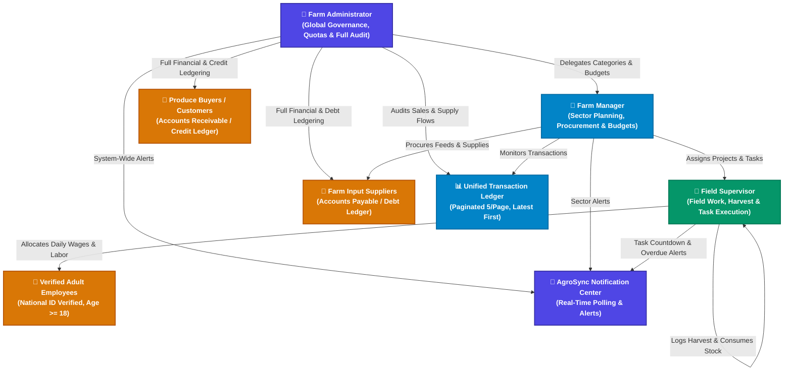

# Software Requirements Specification (SRS)
## AgroSync Farm Management System
**Document Version:** 3.0  
**SDLC Stage:** Production Baseline & Feature Expansion  
**Status:** Approved  

---

## 1. Introduction

### 1.1 Purpose
This Software Requirements Specification (SRS) document details the complete functional, non-functional, security, and architectural requirements for **AgroSync** (formerly SmartFarm). It serves as the authoritative single source of truth for engineering, compliance testing, API integration, and operations.

### 1.2 Scope of the System
**AgroSync** is an enterprise-grade cloud agricultural management platform designed for modern commercial farms and agribusinesses. The system integrates:
- **Governance & Financial Control**: Executive oversight, multi-category budgeting, and comprehensive Accounts Payable / Accounts Receivable (AP/AR) ledgering for **Farm Administrators**.
- **Sector Planning & Procurement**: Category-level crop/livestock cycle management, supplier procurement, and supervisor task delegation for **Farm Managers**.
- **Field Operations & Scheduling**: Field activity scheduling with automated agronomic presets, harvest logging, input supply consumption, and verified labor task allocation for **Field Supervisors**.
- **Real-Time Notification Engine**: Instant proactive alerts for pending user approvals, low inventory reorder levels, upcoming/overdue tasks, and financial debts.
- **Unified Transaction Ledger & Pagination**: Comprehensive history of sales and supplies with search, type filtering, chronological descending sorting (latest first), and paginated viewing with page size of 5 records.
- **Labor Compliance & Wage Attribution**: Strict validation of employee legal eligibility ($Age \ge 18$) and per-task wage calculation.

### 1.3 Definitions, Acronyms, and Abbreviations
- **RBAC:** Role-Based Access Control (`ADMIN`, `MANAGER`, `SUPERVISOR`).
- **PBAC:** Privilege-Based Access Control (fine-grained supervisor privileges: `CAN_RECORD_EXPENSES`, `CAN_RECORD_SALES`, `CAN_RECORD_HARVEST`, `CAN_LOG_ACTIVITIES`, `CAN_USE_INVENTORY`, `CAN_VIEW_FINANCIALS`).
- **Accounts Payable (AP):** Cumulative liabilities owed by the farm to input and feed suppliers.
- **Accounts Receivable (AR):** Cumulative uncollected credit balances owed to the farm by produce buyers.
- **Task Presets:** Automated agronomic date calculation offsets (e.g., Planting $+ 14$ days $\rightarrow$ Spraying, $+ 21$ days $\rightarrow$ Weeding, $+ 28$ days $\rightarrow$ Top-Dressing, $+ 60$ days $\rightarrow$ Harvesting).
- **Transaction Pagination:** Fixed 5-record paging slicing with latest-first sorting by date descending and secondary ID tie-breaker.

---

## 2. Overall Description & System Context

### 2.1 System Context Diagram

---

## 3. Functional Requirements

### 3.1 Authentication & User Management (FR-AUTH)
- **FR-AUTH-1 (Bootstrap First Admin):** On an empty database ($0$ users), the registration system automatically provisions the first registrant as the **Primary Farm Administrator** with active status and full privileges.
- **FR-AUTH-2 (Approval Lifecycle):** Subsequent registrations default to `PENDING_APPROVAL`. Users cannot access farm resources until approved by an Administrator or Manager.
- **FR-AUTH-3 (Role & Quota Governance):**
  - Maximum **2 Farm Managers** across the system.
  - Maximum **10 Field Supervisors** across the system.
- **FR-AUTH-4 (Self-Service Password Reset):** Email-based token recovery via Resend HTTP API with a 15-minute token expiry window.

### 3.2 Real-Time Notification Center (FR-NOTIF)
- **FR-NOTIF-1 (Proactive Aggregation):** The system continuously evaluates:
  1. `USERS`: Pending user approval requests.
  2. `INVENTORY`: Items where `quantityInStock <= minStockLevel`.
  3. `TASKS`: Overdue farm activities ($Date < Today$) and upcoming activities due within 7 days.
  4. `FINANCE`: Unpaid supplier purchase invoices (AP) and customer debts (AR).
- **FR-NOTIF-2 (TopBar Integration):** Renders an interactive bell icon with a real-time badge count, pulse animation for new alerts, category filter tabs (`All`, `Tasks`, `Stock`, `Users`, `Finance`), and direct navigation links to resolving pages.
- **FR-NOTIF-3 (Polling Interval):** Client refreshes notifications every 45 seconds and on active route transitions.

### 3.3 Farm Task Scheduling & Presets Engine (FR-SCHED)
- **FR-SCHED-1 (Quick Agronomic Presets):** One-click date and parameter calculation for standard crop cycles:
  - `+2 Wks (Spraying)`: Sets scheduled date to $+14$ days, priority `HIGH`, type `Field Care`.
  - `+3 Wks (Weeding)`: Sets scheduled date to $+21$ days, priority `MEDIUM`, type `Field Care`.
  - `+4 Wks (Top-Dressing)`: Sets scheduled date to $+28$ days, priority `HIGH`, type `Fertilization`.
  - `+2 Mos (Harvesting)`: Sets scheduled date to $+60$ days, priority `URGENT`, type `Harvesting`.
- **FR-SCHED-2 (Task Lifecycle):** Tasks support statuses: `SCHEDULED`, `IN_PROGRESS`, `COMPLETED`, `CANCELLED` and priority tiers: `LOW`, `MEDIUM`, `HIGH`, `URGENT`.
- **FR-SCHED-3 (Countdown & Overdue Badges):** Cards dynamically render badges: `Due Today` *(Amber)*, `In X days` *(Blue)*, `Overdue by X days` *(Red)*, `Completed` *(Green checkmark)*.
- **FR-SCHED-4 (One-Click Completion):** Allows users to mark tasks as completed directly from the activity feed via `PATCH /activities/{id}/status`.

### 3.4 Production, Projects & Inventory Management (FR-PROD)
- **FR-PROD-1 (Category & Project Hierarchy):** Category (e.g. Dairy, Poultry, Horticulture) $\rightarrow$ Projects (e.g. Greenhouse 1, Broiler Batch A) $\rightarrow$ Records (Expenses, Activities, Harvest, Sales).
- **FR-PROD-2 (Inventory & Supply Consumption):** Direct tracking of chemical, feed, fertilizer, and tool stocks with stock-deduction on farm usage (`POST /inventory/{id}/use`).
- **FR-PROD-3 (Harvest & Produce Stock Control):** Sales cannot exceed harvested stock for any produce item.

### 3.5 Trade, Debt Ledgering & Financial Analytics (FR-FIN)
- **FR-FIN-1 (Accounts Payable / Suppliers):** Tracks external suppliers, purchase invoices, payment modes (`CASH`, `BANK`, `MPESA`, `CREDIT_LEDGER`), and outstanding liabilities.
- **FR-FIN-2 (Accounts Receivable / Customers):** Tracks customer debt, invoice balances, payment histories, and credit limits.
- **FR-FIN-3 (Executive Dashboard Metrics):** Multi-card auto-fit grid displaying:
  - Total Revenue Collected
  - Revenue Received (Cash In Bank)
  - Cumulative Customer Debt (Uncollected AR)
  - Unpaid Supplier Invoices (Pending AP)
  - Total Expenses & Net Farm Value
- **FR-FIN-4 (Unified Transaction History & Pagination Engine):**
  - Consolidates incoming crop/livestock sales and outgoing farm supply procurement records into a unified chronological ledger.
  - **Ordering:** Guarantees strict `latest first` presentation by sorting on transaction date descending (`dateB.localeCompare(dateA)`), with a deterministic tie-breaker on ID descending.
  - **Pagination:** Fixed page size of **5 records per page** (`TX_PAGE_SIZE = 5`). Provides intuitive pagination controls (Previous/Next buttons, active numeric page pills, and record count indicators `Showing X to Y of Z transactions`).
  - **Filtering & Search:** Real-time text search across reference code, party name, and item description, combined with quick type filtering (`All`, `Sales Only`, `Supplies Only`). Page resets to 1 automatically upon filter or search change.

### 3.6 Labor Compliance & Wage Attribution (FR-LABOR)
- **FR-LABOR-1 (National ID & Age Enforcement):** Strict age validation ($Age \ge 18$) based on date of birth and verified government ID numbers.
- **FR-LABOR-2 (Task Rostering & Wage Calculation):** Assignment of multiple verified employees to specific activities with custom wage amounts and payment status tracking.

---

## 4. Non-Functional Requirements (NFR)

### 4.1 Performance & Scalability
- **NFR-PERF-1:** Sub-100ms average backend response time for dashboard aggregations and notification polling.
- **NFR-PERF-2:** Database connection pool optimization with `spring.jpa.open-in-view=false`.
- **NFR-PERF-3:** Frontend asset bundle optimization with code splitting, compressed SVG assets, and sub-3s production builds.

### 4.2 Security & Access Control
- **NFR-SEC-1:** Passwords encrypted using BCrypt (strength 10).
- **NFR-SEC-2:** Stateless request validation with `X-User-Id` and `X-User-Role` verification.
- **NFR-SEC-3:** Supervisor financial isolation (cost amounts, sales margins, and company cash balances are masked for non-authorized supervisors).

### 4.3 Reliability & Availability
- **NFR-REL-1:** Graceful zero-state handling when network disruptions occur.
- **NFR-REL-2:** Automated database schema migration and validation on application startup.
