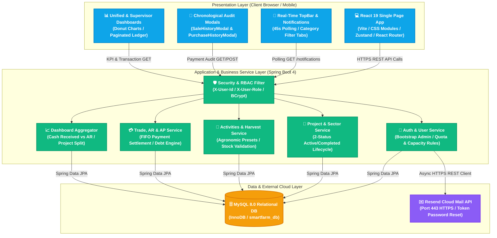
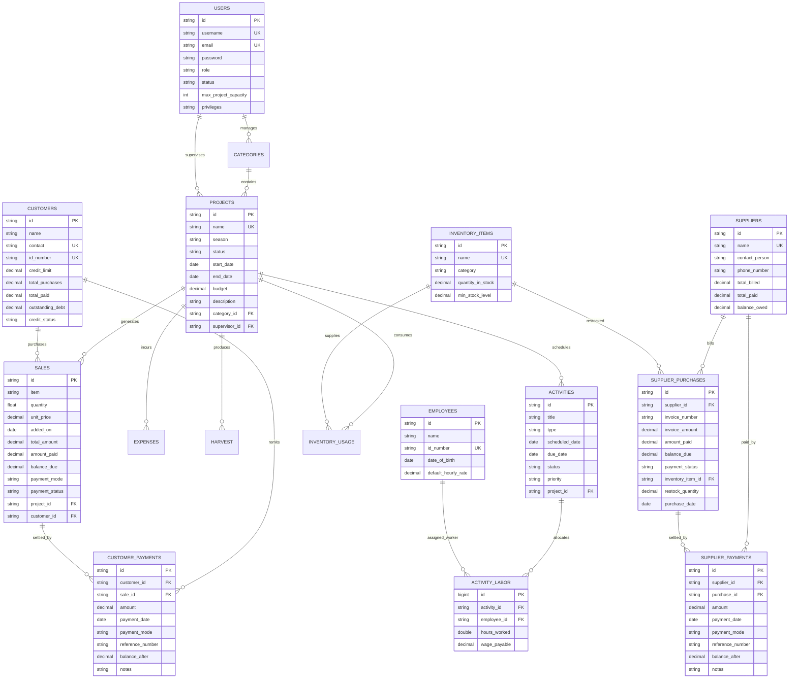
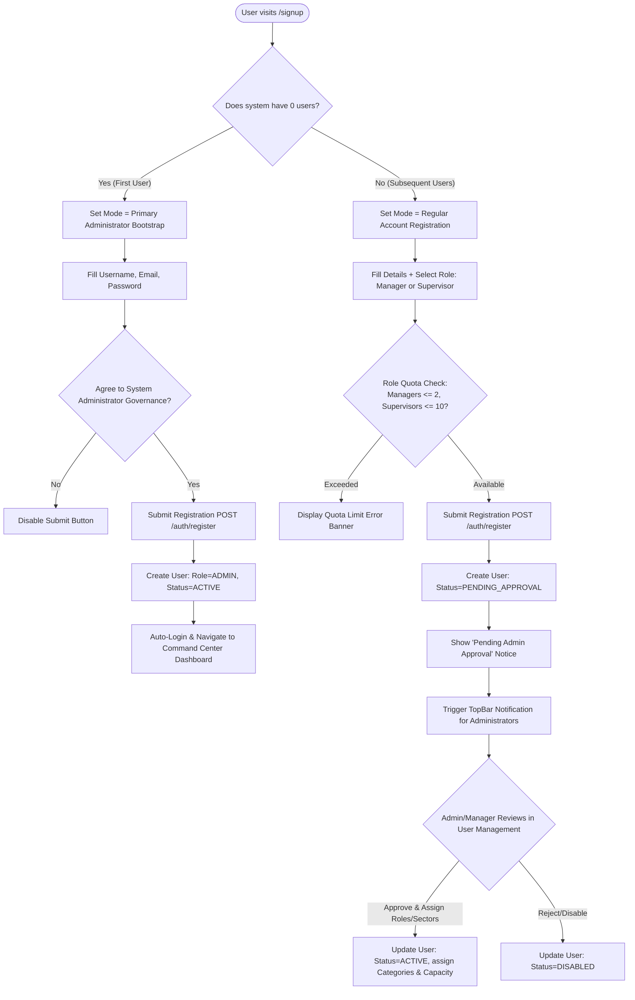
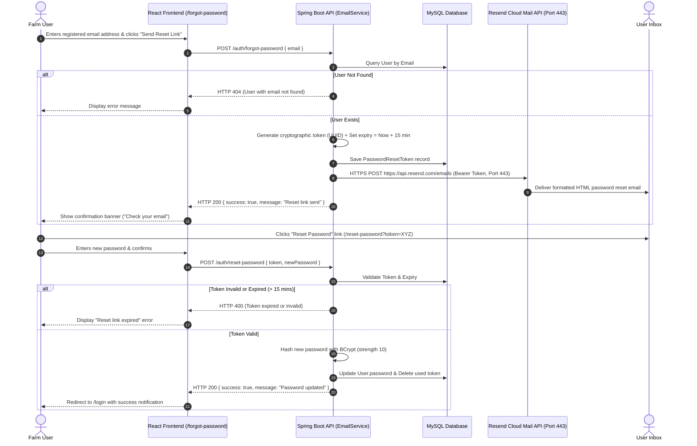
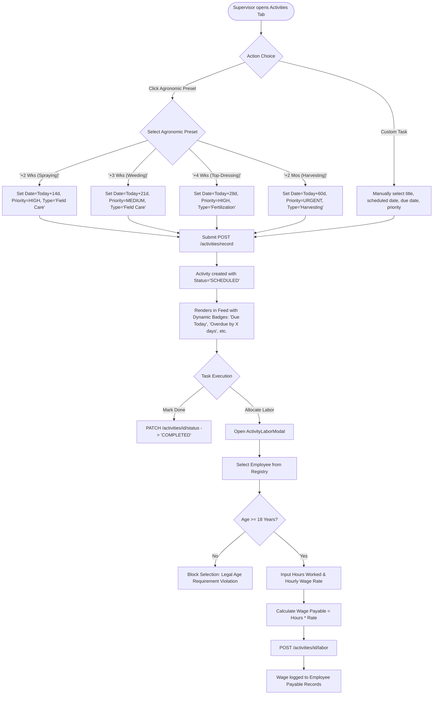
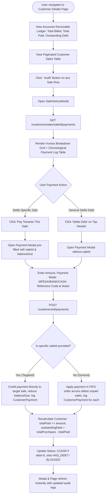
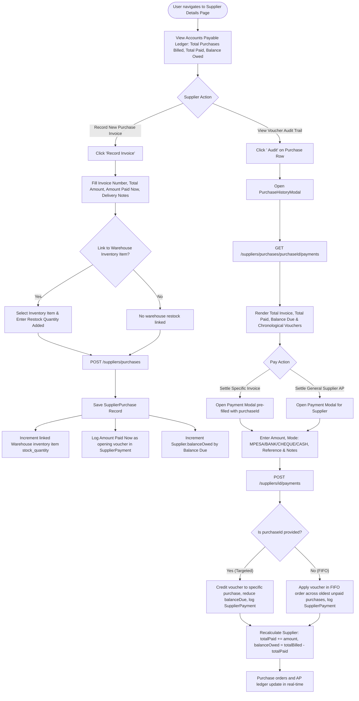
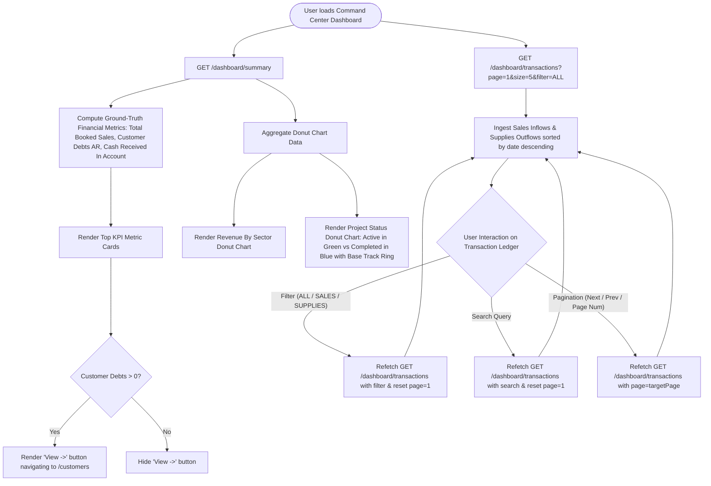

# Complete System Flowcharts & Process Workflows
## AgroSync Farm Management System
**Document Version:** 4.0  
**SDLC Stage:** Operational Flowcharts & Workflow Specifications  
**Status:** Approved  

---

## 1. High-Level System Architecture & Component Interactions



---

## 2. Comprehensive Entity-Relationship Model (ERD)



---

## 3. User Registration, Bootstrap & Approval Lifecycle



---

## 4. Password Recovery & Resend Cloud API Flow



---

## 5. Streamlined Project Lifecycle & Sector Delegation Flow (2-Status Model)

```mermaid
flowchart TD
    Start([Manager / Admin enters Category Page]) --> ClickCreate[Click '+ Create Project']
    
    ClickCreate --> CheckBudgetPrivilege{Has CAN_MANAGE_BUDGETS Privilege?}
    CheckBudgetPrivilege -- No --> DenyCreate[HTTP 403: Access Denied]
    CheckBudgetPrivilege -- Yes --> OpenForm[Open Project Creation Form]
    
    OpenForm --> FillProjectForm[Fill Project Name, Season, Start/End Dates, Budget, Description]
    FillProjectForm --> SelectStatus[Select Project Status: 'Active' or 'Completed']
    SelectStatus --> ValidateDates{Start Date <= End Date?}
    ValidateDates -- No --> DateError[Notify: Start date cannot be after end date]
    ValidateDates -- Yes --> CheckNameUnique{Project Name Unique?}
    CheckNameUnique -- Duplicate --> NameError[Notify: Project name already exists]
    CheckNameUnique -- Unique --> SubmitProject[POST /projects/create]
    
    SubmitProject --> SaveProject[Project Created in MySQL with Status = 'active' or 'completed']
    SaveProject --> AssignSupervisor{Assign Supervisor?}
    AssignSupervisor -- Yes --> CheckCapacity{Supervisor Active Projects < Capacity (default 4)?}
    CheckCapacity -- Full --> CapacityAlert[Display Capacity Limit Warning]
    CheckCapacity -- OK --> LinkSupervisor[Attach supervisor_id to project]
    
    LinkSupervisor --> ProjectDashboard[Project Dashboard Activated]
    
    ProjectDashboard --> StatusToggle{Project Status Action}
    StatusToggle -- Switch to Completed --> SetCompleted[PATCH /projects/id/status -> 'completed']
    StatusToggle -- Reopen to Active --> SetActive[PATCH /projects/id/status -> 'active']
    SetCompleted --> UpdateDonut[Project Status Donut Chart updates immediately]
    SetActive --> UpdateDonut
```

---

## 6. Field Activity Scheduling, Agronomic Presets & Labor Allocation Flow



---

## 7. Harvest Logging, Warehouse Inventory Usage & Stock-Controlled Selling

```mermaid
flowchart TD
    subgraph Harvest_Intake["1. Harvest Intake"]
        LogHarvest([Harvest Collected]) --> EnterYield[Enter Crop Item, Quantity, Unit & Notes]
        EnterYield --> SaveHarvest[POST /harvest/record]
        SaveHarvest --> IncHarvestStock[Project Cumulative Harvest Stock Incremented]
    end

    subgraph Inventory_Supplies["2. Warehouse Supplies Consumption"]
        UseSupply([Project Consumes Fertilizer/Chemicals]) --> SelectInvItem[Select Inventory Item from Warehouse]
        SelectInvItem --> EnterQtyUsed[Enter Quantity Used & Notes]
        EnterQtyUsed --> DeductStock[POST /inventory/id/use]
        DeductStock --> UpdateWarehouse[Warehouse stock_quantity decremented]
        UpdateWarehouse --> CheckReorder{Stock <= min_stock_level?}
        CheckReorder -- Yes --> TriggerLowStockAlert[Trigger Low Stock Dashboard & Notification Alert]
    end

    subgraph FarmGate_Sales["3. Stock-Controlled Farm-Gate Sales"]
        RecordSaleReq([Customer Buys Produce]) --> SelectProduce[Select Produce Item & Quantity]
        SelectProduce --> CheckAvailStock{Quantity <= (Harvested - Sold)?}
        CheckAvailStock -- No (Insufficient Stock) --> RejectSale[HTTP 400: Cannot sell more than harvested stock]
        CheckAvailStock -- Yes (Stock Available) --> CheckPaymentAmount{Amount Paid < Total Amount?}
        
        CheckPaymentAmount -- Yes (Credit / Partial) --> EnforceCustomer[Require Registered Customer Attachment]
        EnforceCustomer --> CheckCreditLimit{Customer Debt + Balance Due > Credit Limit?}
        CheckCreditLimit -- Yes --> BlockCreditSale[HTTP 400: Customer Credit BLOCKED]
        CheckCreditLimit -- No --> SaveSaleWithDebt[Save Sale: Status='PARTIAL_PAYMENT' or 'CREDIT_UNPAID']
        SaveSaleWithDebt --> AutoLogDownPayment[Log Down-Payment as 1st Entry in CustomerPayment]
        SaveSaleWithDebt --> IncCustomerDebt[Increment Customer.outstandingDebt by Balance Due]
        
        CheckPaymentAmount -- No (Full Payment) --> SaveFullSale[Save Sale: Status='PAID_IN_FULL']
        SaveFullSale --> LogFullPayment[Log Full Payment in CustomerPayment]
        
        SaveSaleWithDebt --> DeductProduceStock[Deduct Sold Volume from Project Available Harvest]
        SaveFullSale --> DeductProduceStock
    end
```

---

## 8. Customer Accounts Receivable, Credit & Installment Audit History Flow



---

## 9. Supplier Purchase Invoices, Warehouse Auto-Restock & AP Voucher Settlement Flow



---

## 10. Executive Dashboard Financial KPI Engine & Paginated Transactions Feed Flow


