# SmartFarm Complete System Flowcharts Specification
**Document Version:** 1.0  
**SDLC Stage:** Phase 2 — System Architecture & Workflow Flowcharts  
**Status:** Approved Reference  

---

## 1. User Authentication, Login & Multi-Method Password Recovery Flow

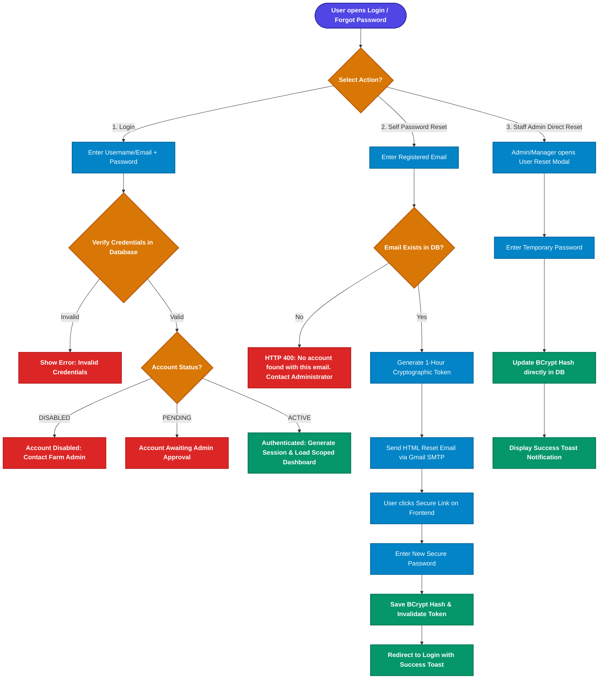

---

## 2. Staff Provisioning, Quota Limits & Status Lifecycle Flow

```mermaid
flowchart TD
    classDef startNode fill:#4f46e5,stroke:#3730a3,stroke-width:2px,color:#ffffff,font-weight:bold;
    classDef adminNode fill:#4f46e5,stroke:#3730a3,stroke-width:2px,color:#ffffff,font-weight:bold;
    classDef managerNode fill:#0284c7,stroke:#0369a1,stroke-width:2px,color:#ffffff,font-weight:bold;
    classDef decisionNode fill:#d97706,stroke:#b45309,stroke-width:2px,color:#ffffff,font-weight:bold;
    classDef errorNode fill:#dc2626,stroke:#b91c1c,stroke-width:2px,color:#ffffff,font-weight:bold;
    classDef successNode fill:#059669,stroke:#047857,stroke-width:2px,color:#ffffff,font-weight:bold;
    classDef actionNode fill:#0284c7,stroke:#0369a1,stroke-width:2px,color:#ffffff;

    ProvStart([Provision Staff Member]):::startNode --> CheckCreatorRole{Creator Role?}:::decisionNode
    
    CheckCreatorRole -- ADMIN --> AdminSelectRole{Select Target Role}:::decisionNode
    AdminSelectRole -- MANAGER --> CheckMgrQuota{Current Managers >= 2?}:::decisionNode
    CheckMgrQuota -- Yes --> BlockMgr[HTTP 400: Maximum Manager limit reached (Max 2)]:::errorNode
    CheckMgrQuota -- No --> InputStaffData[Enter Name, Username, Email, Password]:::actionNode
    
    AdminSelectRole -- SUPERVISOR --> CheckSupQuota1{Current Supervisors >= 10?}:::decisionNode
    CheckSupQuota1 -- Yes --> BlockSup1[HTTP 400: Maximum Supervisor limit reached (Max 10)]:::errorNode
    CheckSupQuota1 -- No --> InputStaffData

    CheckCreatorRole -- MANAGER --> CheckMgrPriv{Has CAN_CREATE_SUPERVISORS?}:::decisionNode
    CheckMgrPriv -- No --> BlockMgrPriv[403 Forbidden: Manager not authorized to create supervisors]:::errorNode
    CheckMgrPriv -- Yes --> CheckSupQuota2{Current Supervisors >= 10?}:::decisionNode
    CheckSupQuota2 -- Yes --> BlockSup2[HTTP 400: Maximum Supervisor limit reached (Max 10)]:::errorNode
    CheckSupQuota2 -- No --> SetMgrParent[Auto-link manager_id = currentManager.id]:::actionNode
    SetMgrParent --> InputStaffData

    InputStaffData --> ValUnique{Username / Email Unique?}:::decisionNode
    ValUnique -- Duplicate --> ErrDup[HTTP 400: Username or Email already in use]:::errorNode
    ValUnique -- Unique --> HashPass[Hash Password with BCrypt cost=10]:::actionNode
    HashPass --> SetInitialStatus{Creator is Admin?}:::decisionNode
    SetInitialStatus -- Yes --> SetActive[Set status = ACTIVE]:::successNode
    SetInitialStatus -- No / Self-Signup --> SetPending[Set status = PENDING_APPROVAL]:::actionNode
    SetActive --> SaveUser[Save User Entity in Database]:::successNode
    SetPending --> SaveUser
    SaveUser --> SuccessToast[Show Success Toast Notification]:::successNode
```

---

## 3. Hierarchical Access Delegation & Capacity Verification Flow (Option B PBAC)

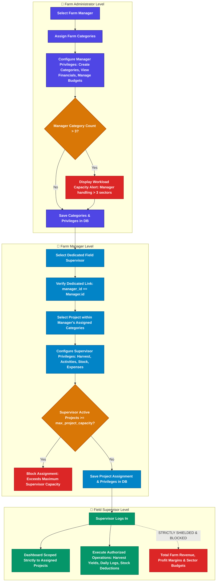

---

## 4. Category Lifecycle & Sector Management Flow

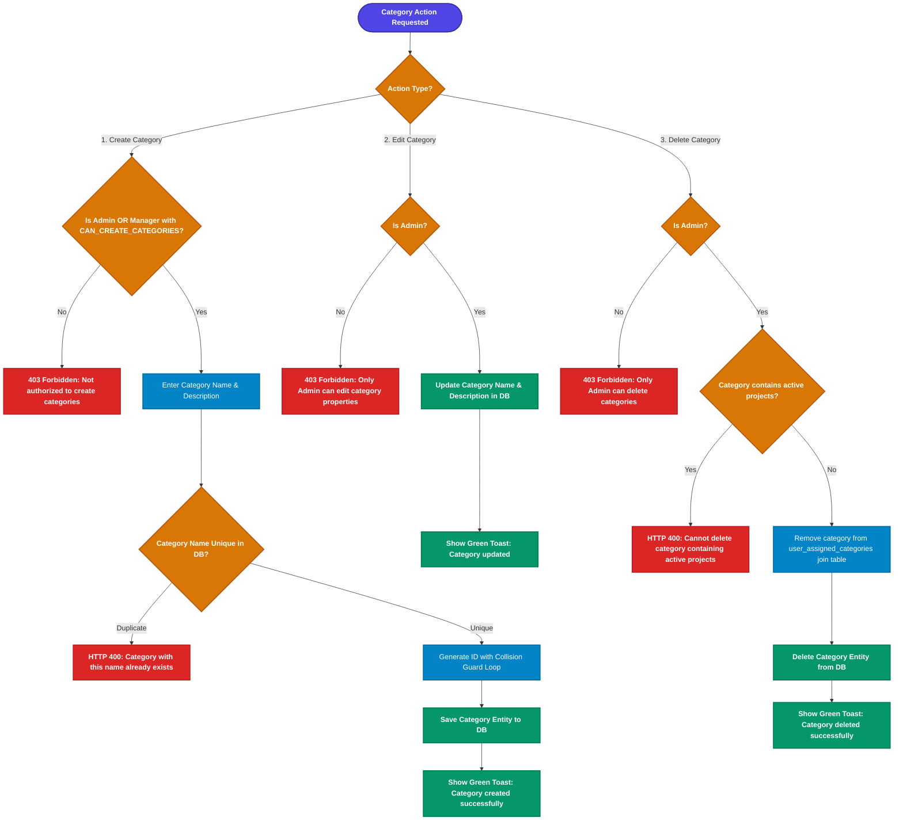

---

## 5. Project Planning & Lifecycle Management Flow

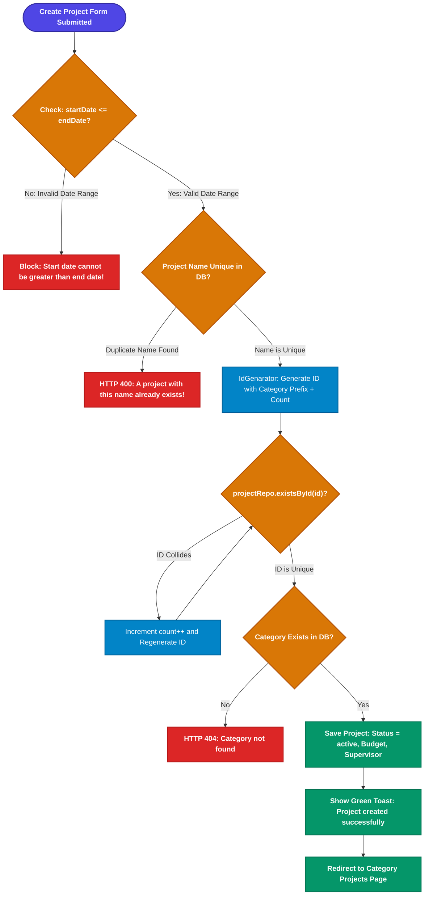

---

## 6. Field Operations & Daily Activity Logging Flow

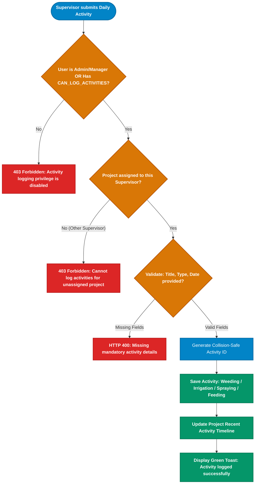

---

## 7. Harvest Yield Recording & Production Pool Flow

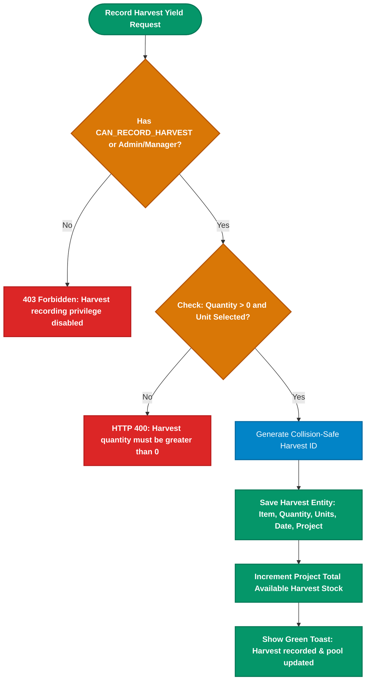

---

## 8. Inventory Stock Management & Project Usage Flow

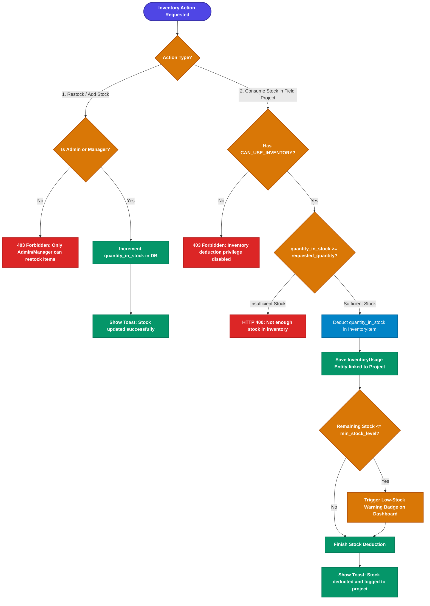

---

## 9. Financial Accounting, Expense Tracking & Budget Auditing Flow

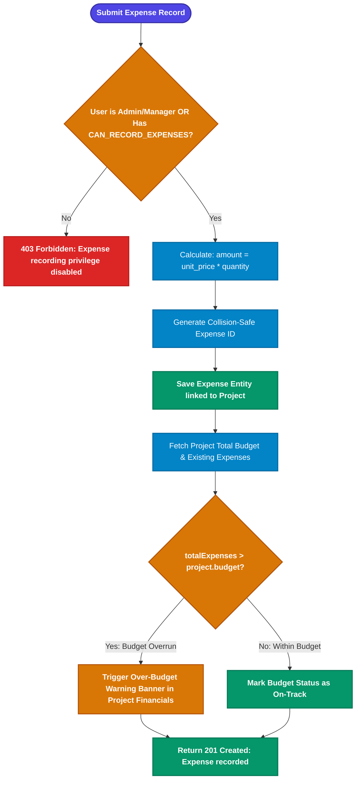

---

## 10. Financial Governance & Stock-Backed Sales Flow

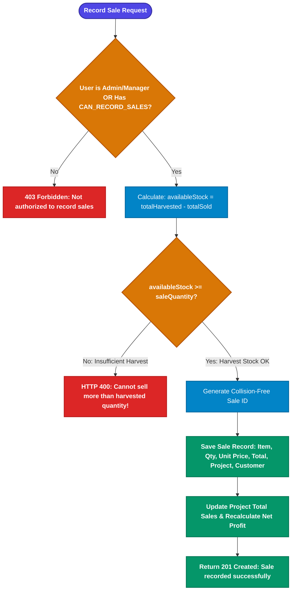

---

## 11. Dynamic Scoped Dashboard & Zero-State Engine Flow

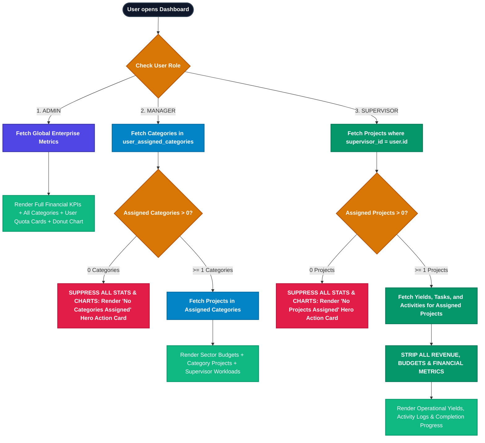

---

## 12. Safe User Deletion & Cascade Unlinking Flow

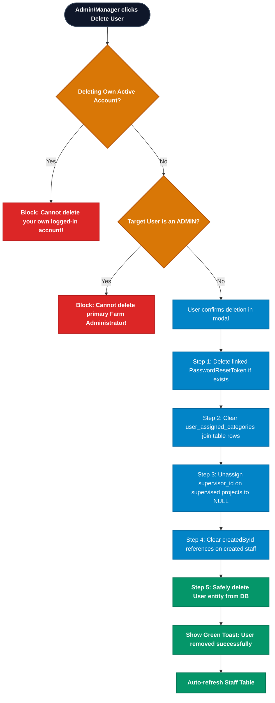
