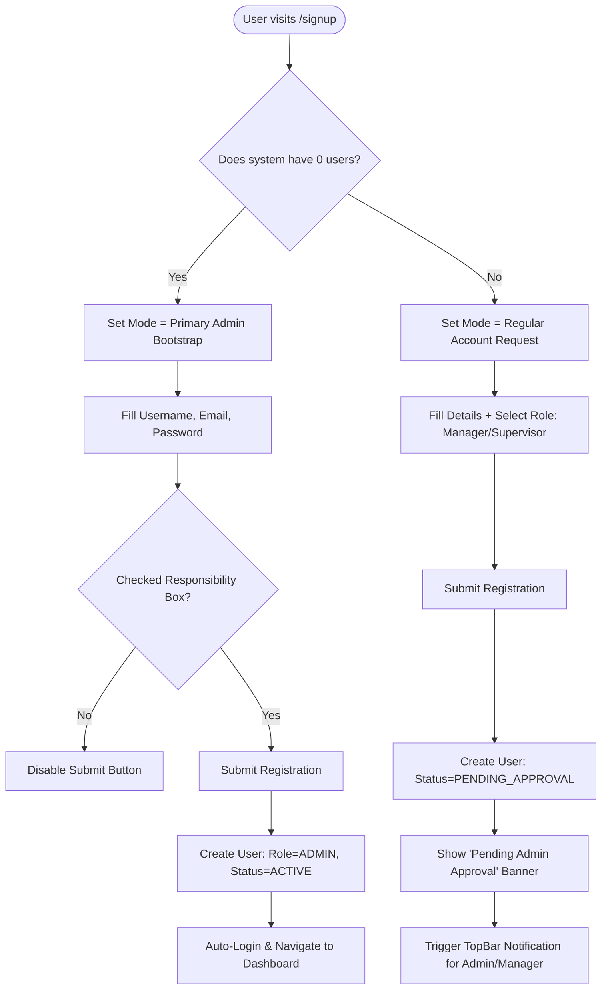
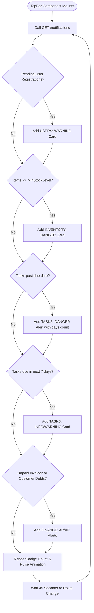
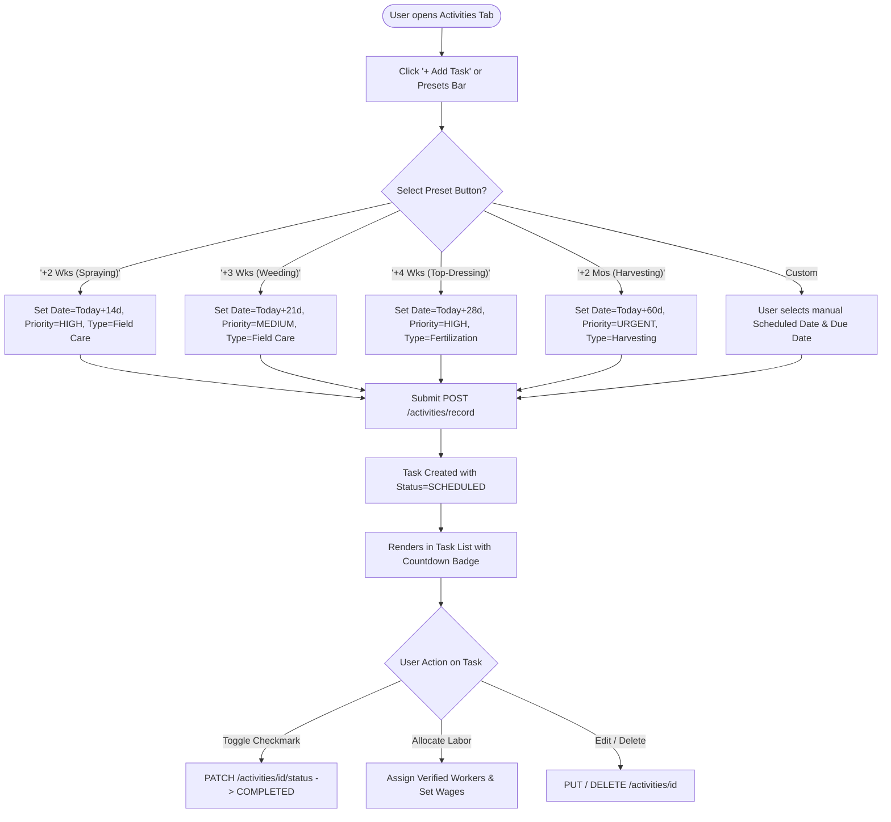

# Complete System Flowcharts & Process Workflows
## AgroSync Farm Management System
**Document Version:** 3.0  
**SDLC Stage:** Operational Flowcharts & Workflow Specifications  
**Status:** Approved  

---

## 1. Authentication & Bootstrap Flow



---

## 2. Real-Time Notification Engine Flow



---

## 3. Farm Task Scheduling with Agronomic Presets



---

## 4. Accounts Payable (AP) & Accounts Receivable (AR) Trade Flow

```mermaid
flowchart TD
    subgraph AP_Suppliers["Accounts Payable (Farm Buys Inputs)"]
        BuyInputs([Farm Buys Feeds / Chemicals]) --> SelectSupplier[Select Registered Supplier]
        SelectSupplier --> RecordPurchase[Record Invoice: Total Amount, Amount Paid]
        RecordPurchase --> CalcAPBalance[Calculate Balance Due = Total - Paid]
        CalcAPBalance --> UpdateSupplierDebt[Increment Supplier.outstandingDebt by Balance Due]
        UpdateSupplierDebt --> APNotif[Trigger Pending Invoice Alert if Balance > 0]
    end

    subgraph AR_Customers["Accounts Receivable (Farm Sells Produce)"]
        SellProduce([Customer Buys Harvest]) --> SelectCustomer[Select Registered Customer]
        SelectCustomer --> RecordSale[Record Sale: Total Amount, Amount Paid]
        RecordSale --> CheckStock{Quantity <= Harvest Stock?}
        CheckStock -- No --> RejectSale[Reject Sale: Insufficient Harvested Produce]
        CheckStock -- Yes --> CalcARBalance[Calculate Balance Due = Total - Paid]
        CalcARBalance --> UpdateCustDebt[Increment Customer.outstandingDebt by Balance Due]
        UpdateCustDebt --> DeductHarvestStock[Deduct available produce from project harvest]
    end
```



---

## 5. Unified Transaction History & Pagination Engine Flow

```mermaid
flowchart TD
    Mount[Unified Dashboard Mounts] --> FetchDashboard[Call GET /dashboard/summary]
    FetchDashboard --> IngestTx[Ingest recentTransactions Array]
    IngestTx --> ListenFilters[Listen to Search Query & Type Filter]
    
    ListenFilters --> FilterArray[Filter by Search Query & Type: ALL / SALES / SUPPLIES]
    FilterArray --> SortDescending[Sort Array: Date Descending, then ID Descending]
    SortDescending --> CalcPagination[Calculate Total Pages = ceil(count / 5)]
    
    CalcPagination --> SliceData[Slice Records: (page - 1) * 5 to page * 5]
    SliceData --> RenderTable[Render 5 Transaction Rows with Status Badges]
    
    RenderTable --> UserPageAction{User Pagination Action}
    UserPageAction -- Click Prev --> PrevPage[Set page = max(1, page - 1)]
    UserPageAction -- Click Next --> NextPage[Set page = min(total, page + 1)]
    UserPageAction -- Click Pill --> SpecificPage[Set page = selected page]
    UserPageAction -- Change Search/Filter --> ResetPage[Auto-reset page = 1]
    
    PrevPage --> SliceData
    NextPage --> SliceData
    SpecificPage --> SliceData
    ResetPage --> FilterArray
```
