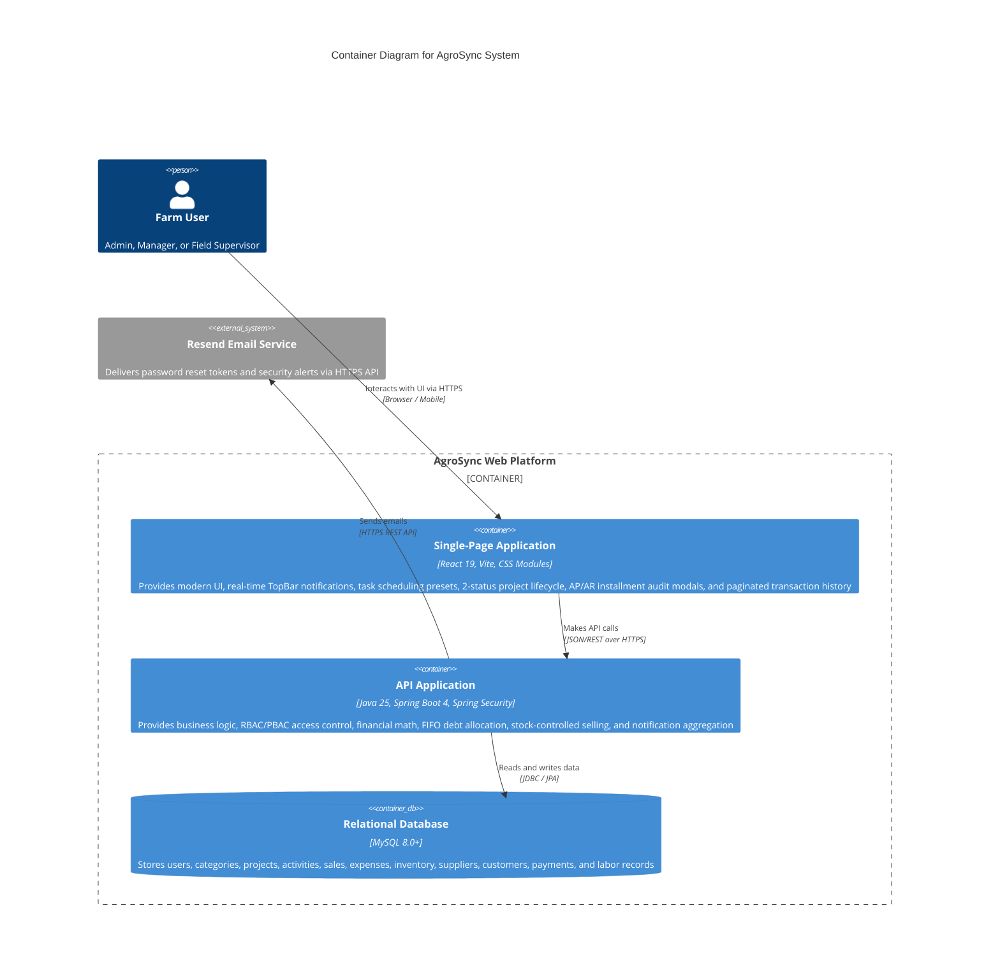
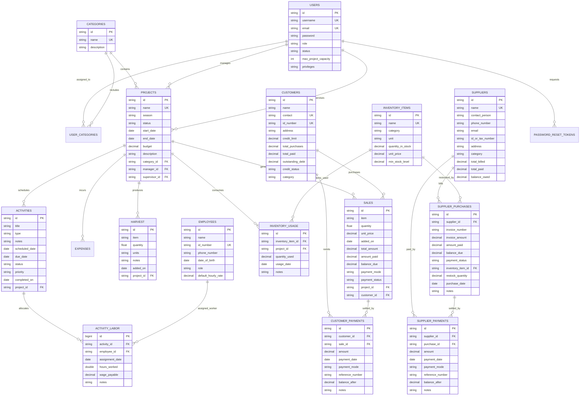

# System Design and Architecture Document
## AgroSync Farm Management System
**Document Version:** 4.0  
**SDLC Stage:** Technical Architecture & Production Blueprint  
**Status:** Approved  

---

## 1. Executive Summary & Architectural Overview

**AgroSync** is built on a decoupled, cloud-native architecture combining a high-performance **Spring Boot 4 (Java 25)** micro-monolith backend with a reactive **React 19 (Vite)** single-page web client and MySQL relational database.


---

## 2. C4 Container Diagram



---

## 3. Comprehensive Entity-Relationship Data Model (ERD)



---

## 4. Financial & Business Logic Engine

### 4.1 Cash Received vs Booked Revenue
The financial engine computes ground-truth liquid cash vs total booked revenue:
$$\text{Total Booked Sales} = \sum_{s \in \text{Sales}} s.\text{total\_amount}$$
$$\text{Pending Customer Debt (AR)} = \sum_{c \in \text{Customers}} c.\text{outstanding\_debt}$$
$$\text{Cash Received (In Account)} = \text{Total Booked Sales} - \text{Pending Customer Debt}$$

### 4.2 Accounts Receivable (AR) & Credit Rules
For any customer $C$:
$$C.\text{outstanding\_debt} = C.\text{total\_purchases} - C.\text{total\_paid}$$
$$\text{Credit Status} = \begin{cases} \text{CLEAR}, & \text{if } C.\text{outstanding\_debt} = 0 \\ \text{BLOCKED}, & \text{if } C.\text{credit\_limit} > 0 \text{ and } C.\text{outstanding\_debt} > C.\text{credit\_limit} \\ \text{HAS\_DEBT}, & \text{otherwise} \end{cases}$$

### 4.3 Accounts Payable (AP) & Supplier Liabilities
For any supplier $S$:
$$S.\text{balance\_owed} = S.\text{total\_billed} - S.\text{total\_paid}$$

### 4.4 Stock-Controlled Selling Validation
When a sale request $R$ is initiated for crop item $I$ in project $P$:
$$\text{Total Harvested} = \sum_{h \in P.\text{Harvest}, h.\text{item} = I} h.\text{quantity}$$
$$\text{Total Sold} = \sum_{s \in P.\text{Sales}, s.\text{item} = I} s.\text{quantity}$$
$$\text{Available Stock} = \max(0, \text{Total Harvested} - \text{Total Sold})$$
$$\text{Validation Rule: If } R.\text{quantity} > \text{Available Stock} \implies \text{Reject Sale (HTTP 400)}$$

### 4.5 FIFO Installment Payment Settlement Algorithm
When an unallocated general debt payment $A$ is submitted for customer $C$ (or supplier $S$):
```text
1. Fetch all unpaid/partial sales of customer sorted by added_on ASC (Oldest First).
2. Remaining Payment R = A
3. FOR EACH sale S IN unpaid_sales:
     IF R <= 0 THEN BREAK
     Available To Settle = S.balance_due
     Payment Allocated P = MIN(R, Available To Settle)
     S.amount_paid += P
     S.balance_due -= P
     IF S.balance_due == 0 THEN S.payment_status = "PAID_IN_FULL"
     ELSE S.payment_status = "PARTIAL_PAYMENT"
     Save S
     Log CustomerPayment Record (amount = P, balance_after = S.balance_due)
     R -= P
4. C.total_paid += A
5. C.outstanding_debt = C.total_purchases - C.total_paid
6. Update customer credit status (CLEAR / HAS_DEBT / BLOCKED)
```

---

## 5. Complete REST API Catalog

| Module | Method | Endpoint | Access Role | Description |
| :--- | :--- | :--- | :--- | :--- |
| **Auth** | `POST` | `/auth/register` | Public | Registers users (Auto-promotes 1st user to ADMIN). |
| | `POST` | `/auth/login` | Public | Authenticates credentials and returns user payload. |
| | `POST` | `/auth/forgot-password` | Public | Generates 15-min token and sends email via Resend API. |
| | `POST` | `/auth/reset-password` | Public | Validates token and resets user password. |
| **Projects** | `POST` | `/projects/create` | Admin / Manager | Creates new project with status `active` or `completed`. |
| | `GET` | `/projects/{category_id}/{category}` | All | Returns paginated projects scoped by user portfolio. |
| | `GET` | `/projects/{projectId}` | All | Returns full project details, tabs, and financial records. |
| | `PUT` | `/projects/{id}` | Admin / Manager | Updates project configuration, season, dates, and budget. |
| | `PATCH`| `/projects/{id}/status` | Admin / Manager / Sup | Toggles project status between `active` and `completed`. |
| **Activities**| `POST` | `/activities/record` | Admin / Mgr / Sup | Creates activity with agronomic preset or custom dates. |
| | `PATCH`| `/activities/{id}/status` | Admin / Mgr / Sup | Updates activity lifecycle status (`SCHEDULED`, `COMPLETED`, etc.). |
| | `POST` | `/activities/{id}/labor` | Admin / Mgr / Sup | Assigns verified employee labor and logs wage payables. |
| **Harvest** | `POST` | `/harvest/record` | Admin / Mgr / Sup | Logs crop or livestock yield volume. |
| **Sales** | `POST` | `/sales/record` | Admin / Mgr / Sup | Records farm-gate sale with stock verification & down-payment. |
| **Customers**| `GET` | `/customers` | All | Lists all customers with cumulative AR balances. |
| | `GET` | `/customers/{id}` | All | Returns customer profile and Accounts Receivable ledger. |
| | `GET` | `/customers/{id}/sales` | All | Returns paginated sales history for this customer. |
| | `GET` | `/customers/sales/{saleId}/payments`| All | Returns chronological installment audit trail for a sale. |
| | `POST` | `/customers/{id}/payments` | Admin / Mgr / Sup | Records installment payment (direct sale or FIFO). |
| **Suppliers**| `GET` | `/suppliers` | Admin / Manager | Lists suppliers with cumulative Accounts Payable balances. |
| | `GET` | `/suppliers/{id}` | Admin / Manager | Returns supplier profile and Accounts Payable ledger. |
| | `GET` | `/suppliers/{id}/purchases` | Admin / Manager | Returns purchase invoice and delivery audit trail. |
| | `GET` | `/suppliers/purchases/{purchaseId}/payments`| Admin / Manager | Returns chronological voucher payment audit trail. |
| | `POST` | `/suppliers/purchases` | Admin / Manager | Records purchase invoice with optional auto-restock. |
| | `POST` | `/suppliers/{id}/payments` | Admin / Manager | Records debt payment voucher (direct invoice or FIFO). |
| **Inventory**| `GET` | `/inventory` | All | Lists warehouse items with quantities and unit prices. |
| | `POST` | `/inventory/{id}/use` | Admin / Mgr / Sup | Deducts supplies consumed directly by a farm project. |
| **Dashboard**| `GET` | `/dashboard/summary` | Admin / Manager | Aggregates KPIs, Sector Donut, Project Donut, and charts. |
| | `GET` | `/dashboard/transactions`| Admin / Manager | Returns paginated unified transaction feed (5 per page). |
| | `GET` | `/supervisor/projects/{userId}`| Supervisor | Returns scoped supervisor field workspace. |
| **Notifs** | `GET` | `/notifications` | All | Aggregates real-time alerts across 4 categories. |

---

## 6. Security Architecture & Exception Handling

### 6.1 Stateless Header Authentication
- Requests transmit `X-User-Id` and `X-User-Role`.
- Spring Security filter chain validates credentials against database records on every request.
- Passwords stored as BCrypt hashes with salt.

### 6.2 Serialization Protection
- Bidirectional JPA relationships (`Sale` $\leftrightarrow$ `Project`, `Activity` $\leftrightarrow$ `Project`, `Harvest` $\leftrightarrow$ `Project`, `InventoryUsage` $\leftrightarrow$ `Project`, `ActivityLaborAssignment` $\leftrightarrow$ `Activity`) are annotated with `@JsonIgnore` on both fields and getters to prevent Jackson circular recursion and StackOverflow errors.

### 6.3 Global Error Handling
- `GlobalExceptionHandler` intercepts exceptions and formats unified HTTP JSON responses:
```json
{
  "body": null,
  "message": "Descriptive error message",
  "success": false,
  "time": "2026-09-11T08:45:00Z"
}
```
