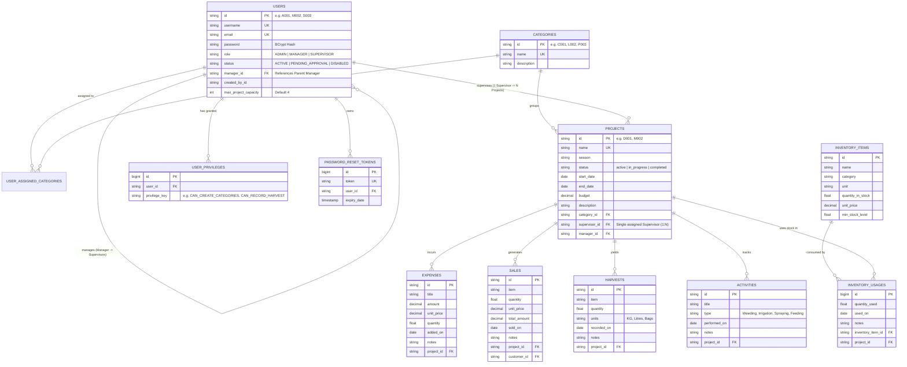
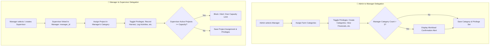
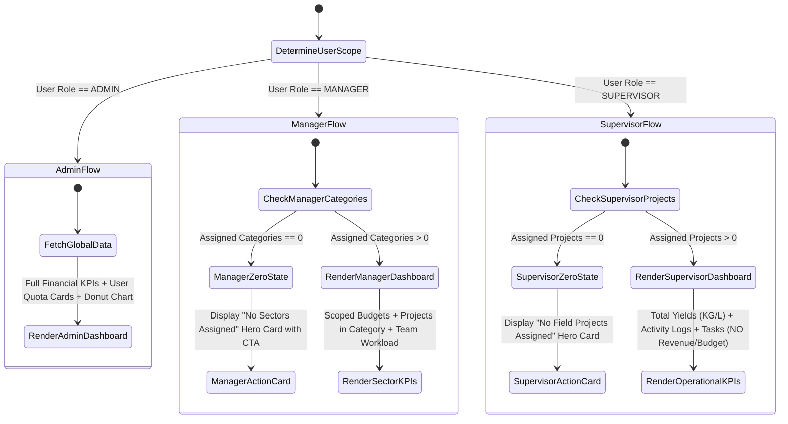

# System Design & Architecture Document (SDD)
## SmartFarm Management Application
**Document Version:** 1.0  
**SDLC Stage:** Phase 2 — System Architecture & Design  
**Status:** Approved Technical Blueprint  

---

## 1. Architectural Overview & Technology Stack

The SmartFarm system follows a **3-Tier Clean Architecture** separating presentation, business orchestration, and persistent storage:

```
┌────────────────────────────────────────────────────────────────────────┐
│                        PRESENTATION TIER                               │
│  - React 18 + Vite SPA                                                 │
│  - Scoped Dashboard Engine (Role-filtered KPIs & Zero-State Cards)     │
│  - Granular Privilege Toggle Modals (PBAC)                             │
│  - Mobile-responsive CSS Modules (Typography: Inter / DM Sans)         │
└───────────────────────────────────┬────────────────────────────────────┘
                                    │ HTTPS / RESTful JSON APIs
                                    ▼
┌────────────────────────────────────────────────────────────────────────┐
│                        APPLICATION / SERVICE TIER                      │
│  - Spring Boot 4.x / Java 21+                                          │
│  - Spring Security + BCrypt Encryption + CORS Filters                  │
│  - Scoped Access Control Enforcers & Workload Validation Engine         │
│  - JavaMailSender HTML Password Recovery Service                       │
└───────────────────────────────────┬────────────────────────────────────┘
                                    │ JDBC / Hibernate ORM 7.x
                                    ▼
┌────────────────────────────────────────────────────────────────────────┐
│                         DATA PERSISTENCE TIER                          │
│  - MySQL 8.0+ / TiDB Cloud Serverless (Zero-Cost Tier)                 │
│  - HikariCP Connection Pooling                                         │
│  - 12 Relational Entities, Strict Foreign Keys & Join Tables           │
└────────────────────────────────────────────────────────────────────────┘
```

---

## 2. Complete Entity-Relationship Model (ERD)



---

## 3. Access Control & Privilege Delegation Engine (PBAC)

### 3.1 Delegation Hierarchy & Workload Guard


### 3.2 Privilege Definition Catalog
| Privilege Key | Applied To | Backend Endpoint Guard | Default State |
| :--- | :--- | :--- | :--- |
| `CAN_CREATE_CATEGORIES` | `MANAGER` | `POST /categories` | Disabled (`false`) |
| `CAN_CREATE_SUPERVISORS`| `MANAGER` | `POST /users/staff` (Role = `SUPERVISOR`) | Enabled (`true`) |
| `CAN_VIEW_FINANCIALS`   | `MANAGER` | `GET /projects/summary`, revenue fields | Enabled (`true`) |
| `CAN_MANAGE_BUDGETS`    | `MANAGER` | `PUT /projects/{id}` (Budget property) | Disabled (`false`) |
| `CAN_RECORD_HARVEST`    | `SUPERVISOR` | `POST /harvest` | Enabled (`true`) |
| `CAN_LOG_ACTIVITIES`    | `SUPERVISOR` | `POST /activities` | Enabled (`true`) |
| `CAN_USE_INVENTORY`     | `SUPERVISOR` | `POST /inventory/use` | Enabled (`true`) |
| `CAN_RECORD_EXPENSES`   | `SUPERVISOR` | `POST /expenses` | Disabled (`false`) |
| `CAN_RECORD_SALES`      | `SUPERVISOR` | `POST /sales` | Disabled (`false`) |

---

## 4. Scoped Dashboard & Zero-State State Machine



---

## 5. API Specification & Security Contracts

### 5.1 Authentication & Password Recovery
- `POST /users/login`: Authenticate via username/email + password; returns user payload with privileges and assigned categories.
- `POST /users/forgot-password`: Validate email existence; if missing returns 400 with admin contact advice; if found sends reset email.
- `POST /users/reset-password`: Consumes token and sets new password.
- `PATCH /users/{id}/admin-reset-password`: Direct password reset by Admin or Manager.

### 5.2 Access Control & Delegation Endpoints
- `PATCH /users/{id}/categories`: Admin assigns categories to Manager. Payload: `{ categoryIds: string[] }`.
- `PATCH /users/{id}/privileges`: Assign fine-grained privilege set. Payload: `{ privileges: string[] }`.
- `PATCH /projects/{id}/supervisor`: Manager assigns supervisor to project. Payload: `{ supervisorId: string }`.
- `GET /users/supervisors`: Fetch supervisors managed by current manager.

### 5.3 Scoped Data & Financial Shielding Endpoints
- `GET /projects/summary`: Scoped aggregate response:
  - **Admin:** Global farm budget, active projects, all categories.
  - **Manager:** Aggregates strictly for `assignedCategories`.
  - **Supervisor:** Returns operational metrics (yield total, activity count); **omits budget/sales revenue**.
- `GET /categories`:
  - **Admin:** All categories.
  - **Manager:** Only categories in `assignedCategories`.
  - **Supervisor:** Only categories containing assigned projects.

---

## 6. Frontend Architecture & Zero-State Components

### 6.1 Component Hierarchy
```
App.jsx (Router)
 ├── TopBar (Profile, Notifications, Dynamic Role Badges)
 ├── MainLayout (Sidebar with Role-conditional Navigation)
 └── Pages
      ├── DashboardPage (Dynamic Zero-State Engine & Scoped KPIs)
      ├── ProjectListPage (Scoped Category Projects)
      ├── ProjectFormPage (Date Validation startDate <= endDate)
      ├── ProjectDashboardPage (Financial Shield for Supervisors)
      └── UserManagementPage (Admin Quotas, Manager Team, Privilege Modals)
```

### 6.2 Zero-State Visual Specification
When an unassigned user visits `DashboardPage.jsx`:
- **Card Removal:** Suppresses all stats grid cards, charts, and table rows.
- **Hero Message Card:** Displays elevated card with icon, title, explanatory text, and action buttons based on granted privileges:
  - *Manager without categories:*
    - Text: *"You currently have no farm categories assigned to your management portfolio."*
    - CTA 1: `[+ Create New Category]` (If `CAN_CREATE_CATEGORIES` is true).
    - CTA 2: `[Contact Administrator]`.
  - *Supervisor without projects:*
    - Text: *"You have not been assigned to any active field projects yet."*
    - CTA: *"Please notify your Farm Manager ([Manager Name]) to assign you a field project."*

---

## 7. Cloud Deployment Topology ($0/month Architecture)

```
[ Clients / Mobile / Desktop Browsers ]
                 │
                 ▼
     [ Vercel Edge Network ]  <─── smartfarm-frontend-jade.vercel.app (React SPA)
                 │
                 ▼ (REST API Calls)
     [ Render Web Service ]   <─── smartfarm-backend-nhi7.onrender.com (Spring Boot JAR)
                 │
                 ├───────────────────────────────┐
                 ▼                               ▼
     [ TiDB / Aiven Cloud ]          [ Gmail SMTP Gateway ]
     (MySQL Database Server)         (Password Reset Emails)
                 ▲
                 │ (HTTP Ping every 5 mins)
     [ UptimeRobot Heartbeat ]
```

---

## 8. SDLC Traceability Matrix

| Requirement ID (SRS) | Architectural Component (SDD) | Verification Method |
| :--- | :--- | :--- |
| **FR-1.3** (Email Check on Forgot Password) | `UserService.forgotPassword` | Unit Test + Live Endpoint Test |
| **FR-2.2** (Admin Manager PBAC Delegation) | `UserPrivilege`, `UserController` | MockMvc Test + Modal UI |
| **FR-2.3** (Manager Supervisor PBAC) | `UserService.assignSupervisorPrivileges` | MockMvc Test + Modal UI |
| **FR-3.2** (Supervisor Capacity Check) | `ProjectsService.assignSupervisor` | Capacity Validation Unit Test |
| **FR-4.2** (Date Validation `start <= end`) | `ProjectsService` + `ProjectFormPage` | Form & API 400 Bad Request Test |
| **FR-6.2** (Supervisor Financial Shield) | `ProjectDashboardPage.jsx` + API DTO | Supervisor Profile Assertion |
| **FR-7.4** (Zero-State Dashboard) | `DashboardPage.jsx` Zero-State Engine | Browser Rendering Test |
| **FR-8.2** (Safe Cascade Deletion) | `UserService.deleteUser` | Foreign Key Clean Cascade Test |
