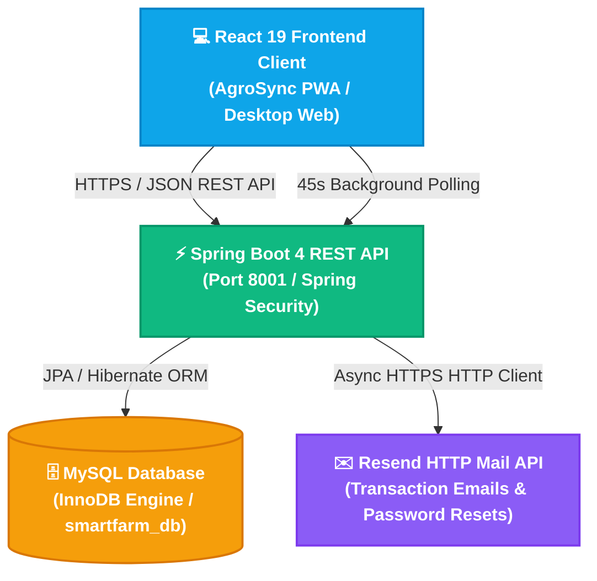
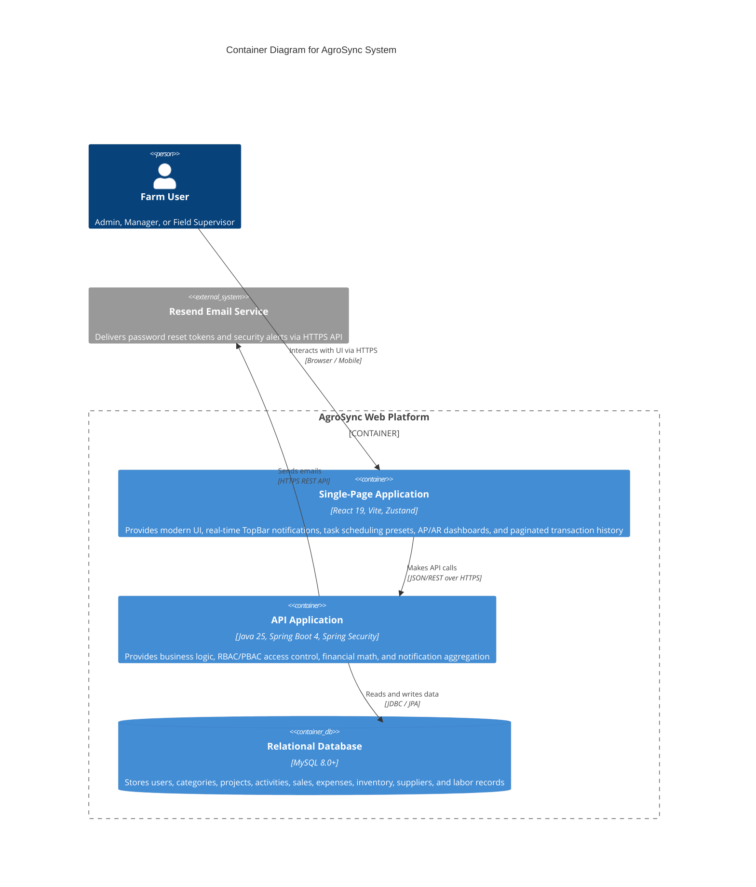
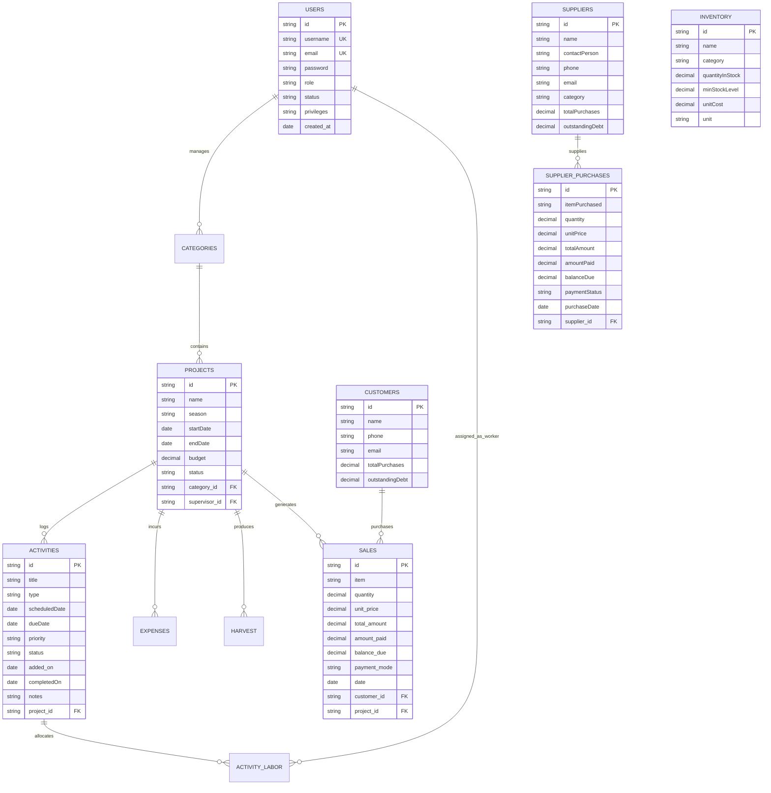

# System Design and Architecture Document
## AgroSync Farm Management System
**Document Version:** 3.0  
**SDLC Stage:** Technical Architecture & Production Blueprint  
**Status:** Approved  

---

## 1. Executive Summary & Architectural Overview

**AgroSync** is built on a decoupled, cloud-native architecture combining a high-performance **Spring Boot 4 (Java 25)** micro-monolith backend with a reactive **React 19 (Vite)** single-page web client.



---

## 2. C4 Container Diagram



---

## 3. Entity-Relationship Data Model (ERD)



---

## 4. REST API Endpoint Catalog

### 4.1 Notifications & Real-Time Alerts
| Method | Endpoint | Role Guard | Description |
| :--- | :--- | :--- | :--- |
| `GET` | `/notifications` | All Authenticated | Returns real-time pending approvals, low stock, upcoming/overdue tasks, and debt alerts |

### 4.2 Activities & Task Scheduler
| Method | Endpoint | Role Guard | Description |
| :--- | :--- | :--- | :--- |
| `POST` | `/activities/record` | Admin, Manager, Supervisor (`CAN_LOG_ACTIVITIES`) | Creates a new farm task / activity with scheduled date and priority |
| `PUT` | `/activities/{id}` | Admin, Manager | Updates task details, scheduled date, due date, priority, and status |
| `PATCH` | `/activities/{id}/status?status=COMPLETED` | Admin, Manager, Supervisor | Toggles task status between `SCHEDULED` and `COMPLETED` |
| `DELETE` | `/activities/{id}` | Admin, Manager | Deletes activity record |
| `GET` | `/activities/{id}/labor` | All Authenticated | Retrieves labor roster and wage allocations for this task |
| `POST` | `/activities/{id}/labor` | Admin, Manager, Supervisor | Assigns verified workers with wages to this activity |

### 4.3 Dashboard & Financial Ledger
| Method | Endpoint | Role Guard | Description |
| :--- | :--- | :--- | :--- |
| `GET` | `/dashboard/summary` | All Authenticated (Scoped by Role) | Returns executive KPIs (Revenue Received, Customer Debt, Supplier Debt, Net Value, Sales Trends, Recent Transactions) |

### 4.4 Suppliers (Accounts Payable)
| Method | Endpoint | Role Guard | Description |
| :--- | :--- | :--- | :--- |
| `GET` | `/suppliers` | Admin, Manager | Lists all suppliers and total purchase liabilities |
| `POST` | `/suppliers` | Admin, Manager | Registers a new supplier |
| `POST` | `/suppliers/purchases` | Admin, Manager | Records supply purchase with AP ledger tracking |

### 4.5 Customers (Accounts Receivable)
| Method | Endpoint | Role Guard | Description |
| :--- | :--- | :--- | :--- |
| `GET` | `/customers` | Admin, Manager | Lists all customers with outstanding debt balances |
| `POST` | `/customers` | Admin, Manager, Supervisor | Registers customer / credit profile |

---

## 5. Unified Dashboard & Transaction History Data Architecture

### 5.1 Transaction Consolidation & Ingestion
The dashboard consolidates incoming revenue operations (Produce Sales) and outgoing input procurement (Supplier Purchases) into a singular, normalized data stream:
```javascript
{
  id: String,
  type: 'SALE' | 'SUPPLY',
  date: 'YYYY-MM-DD',
  partyName: String, // Customer name or Supplier name
  item: String,      // Crop/produce sold or input purchased
  amount: Number,    // Total value
  paid: Number,      // Inflow or Outflow amount settled
  balance: Number,   // Remaining debt balance
  paymentStatus: 'PAID' | 'PARTIAL' | 'UNPAID',
  paymentMode: String
}
```

### 5.2 Deterministic Ordering & Pagination State Machine
1. **Filtering**: Applies search string against `partyName`, `item`, `id`, and payment mode, combined with type filter (`ALL`, `SALES`, `SUPPLIES`).
2. **Latest-First Sorting**:
   ```javascript
   const sorted = filtered.sort((a, b) => {
     const dateA = a.date || '';
     const dateB = b.date || '';
     const dateDiff = dateB.localeCompare(dateA);
     if (dateDiff !== 0) return dateDiff;
     return String(b.id || '').localeCompare(String(a.id || ''));
   });
   ```
3. **Fixed-Size Slicing (`TX_PAGE_SIZE = 5`)**:
   - `totalTxPages = Math.ceil(sorted.length / 5)`
   - `paginatedTx = sorted.slice((page - 1) * 5, page * 5)`
   - Auto-reset hook resets `page -> 1` whenever search or category filter updates.

---

## 6. Security & Access Control Architecture

1. **Stateless Header-Based Verification**:
   - `X-User-Id`: Identifies the authenticated actor.
   - `X-User-Role`: Enforces `ADMIN`, `MANAGER`, or `SUPERVISOR` boundaries.
2. **Supervisor Isolation**:
   - Supervisor requests automatically filter to records where `supervisor_id = current_user.id`.
   - Financial aggregate amounts (e.g. Total farm revenue, global debts) are completely hidden for supervisors without the `CAN_VIEW_FINANCIALS` privilege.
3. **CORS & CSRF**:
   - Configured in `SecurityConfig.java` to allow secure API requests from authorized frontend hosts while enforcing strict header policies.
